# SCM 当前分支收敛、合并与独立仓发布同步执行计划

> **For agentic workers:** REQUIRED SUB-SKILL: Use `superpowers:executing-plans` to execute this plan task-by-task. 用户已授权计划内 branch / commit / push / PR / merge 自动执行；branch deletion、production deploy 与真实 provider call 仍不在自动授权面。步骤使用 checkbox 追踪。

**Goal:** 在不丢失当前脏工作区资产、不混入无关 monorepo 历史、不绕过 provider/生产边界的前提下，把 SCM 可审计候选链合入 `data_analysis_expert/main`，再以内容同步 PR 更新独立 `scm/main`。

**Architecture:** `data_analysis_expert/main` 作为开发单一事实源，SCM 源码位于 `scm/`；`zjgulai/scm/main` 作为独立发布镜像，不与 monorepo 做 unrelated-history merge。原 18 个 draft PR 已按 Foundation / UI Proof / Manual Gate 三个波次重建并合入 source main，7 月 post-stack allowlist 也已合入；独立仓使用内容同步 PR。当前新增一层 post-merge review remediation，先在 source PR 解决评审项，再重新同步 standalone。

**Tech Stack:** Git、GitHub CLI、CodeGraph、React 19、Vite 7、TypeScript 5、Node 22、`node:sqlite`、Playwright、Docker Compose。

---

## 1. 结论先行

**当前方案：source PR #26 已合并；standalone PR #3 的反向审查发现先回补 source-of-truth，再重新同步 standalone，不把 CodeRabbit check=pass 误当成 actionable comments=0。**

1. 开发主线仍固定为 `origin/main`（`zjgulai/data_analysis_expert`）；当前 source main 为 merge commit `7d929aa9dd2edcb2734c9478859f26db516e376d`。
2. source PR #26 exact-head `d0287648671ab6853daee0196fa8d6322cefea50` 已完成 CI / review 并 merge；旧 branches 继续保留。
3. standalone main 仍为 `d722c41353a549f757b19fc62efbb2530bedca47`；PR #3 exact-head `6981bcebba2ac03679ace897eed2d8737d0c4b9e` 的本地、Docker、清单校验已通过。
4. standalone PR #3 的 CodeRabbit check 虽显示 pass，但正式 review 有 5 个 inline finding 与 1 个 outside-diff manifest finding，因此 PR 保持 open。
5. source follow-up PR #27 初始 exact-head `e7d9f9dd35211372bc318b1fbe603292af88a63a` 已通过 clean clone 与 SCM integration gate；正式 review 又发现 3 个文档一致性 finding 和 1 个启动总时限 finding，当前候选正在关闭这 4 项，尚未 merge。
6. 用户已授权本计划内 branch / commit / push / PR / merge 自动执行；branch 删除、production deploy 与真实 provider call 继续排除。

定性把握：**高**（关于当前 Git、review 与本地 RED→GREEN 事实）。依据是新鲜 Git/GitHub API、PR #3 / #27 正式 review、目标 smoke、SQLite hash 与进程泄漏检查；PR #27 新候选的远端 CI / 复审及 standalone 新 exact-head 尚未形成，生产运行态未在本轮重新验收。

## 1.1 当前执行断点（2026-07-16）

- source PR #26 已 merge；source main `7d929aa9dd2edcb2734c9478859f26db516e376d` 的第二 parent 为 exact-head `d0287648671ab6853daee0196fa8d6322cefea50`。
- standalone PR #2 已 merge；standalone main `d722c41353a549f757b19fc62efbb2530bedca47`。PR #3 当前 open，首轮 exact-head 为 `6981bcebba2ac03679ace897eed2d8737d0c4b9e`。
- PR #3 review `4712352355` 已完整读取：5 个 inline finding；review body 另列 1 个 outside-diff manifest finding。check=pass 不覆盖这些 actionable comments。
- 当前 source 执行分支为 `codex/scm-standalone-review-followup-20260716`，base 为 `origin/main@7d929aa`；PR #3 反向发现的 5 项源代码整改已完成目标 RED→GREEN。
- source PR #27 初始 exact-head `e7d9f9d` 的 clean clone、SCM integration gate 与 CodeRabbit check 已通过，但正式 review `4712626799` 有 3 个 inline 文档 finding 和 1 个 outside-diff 启动总时限 finding，因此未 merge。
- RED→GREEN 覆盖：task-type 状态契约、decision 双引用回滚、144 条 subject 映射、完整 migration-owned state 幂等、signal exit 与 SIGKILL 收尾。
- standalone 后续必须从 source follow-up merge commit 重同步，并恢复 `preservedTargetOnlyFiles` 9 条 checksum-bearing records。
- 源 SQLite SHA-256 保持 `3d972e46ec43a64ad69265f295af4ffd9039dfe721a0e9f7f22d02e9b7652af7`。
- 3 个 manual gates 保持 30 owner pending / 18 mapping pending / 1 SCEI source pending；`provider_call=false`、`provider_attempt_made=false`、`database_write=local-test-only`、`production unchanged`。
- 原始脏工作区 `/Users/pray/project/ecom_ana_overview/scm` 未修改；本批次只在 clean source worktree 中执行。

## 2. 审计基线（2026-07-16）

### 2.1 CodeGraph 与项目结构

| 项目 | 当前证据 |
|---|---|
| `codegraph init .` | 已初始化；命令正常返回，不重复创建。 |
| `codegraph sync .` | fresh `main` 成功；再次执行返回 `Already up to date`。 |
| `codegraph status` | 45 files / 2,040 nodes / 4,522 edges，index up to date。 |
| 主要前端 | `src/main.tsx` + 14 个 TSX panel + 6 个 TS model/shared 文件。 |
| 主要后端 | `server/index.mjs`，Node HTTP server + SQLite；当前约 4,596 行。 |
| API 面 | 静态扫描约 46 个 GET、18 个 POST、2 个 HEAD 分支。 |
| 高影响点 | 前端 `api()` 影响至少 20 个符号；`main.tsx` 仍是集成中心。 |

CodeGraph 不索引 Markdown、SQLite、Excel 与大部分证据资产，因此合并判断同时依赖 Git tree、文档、SQLite 只读检查和 smoke，不能只看代码图。

### 2.2 双远端事实

| 远端 | 主线 | 事实 | 处理 |
|---|---|---|---|
| `origin` = `zjgulai/data_analysis_expert` | `origin/main@7d929aa` | PR #20–#26 已 merge；SCM 以 `scm/` 子目录进入。当前 follow-up branch 从此 SHA 派生。 | 开发单一事实源；先关闭 PR #27 review findings 再 merge。 |
| `scm` = `zjgulai/scm` | `scm/main@d722c41` | standalone PR #2 已 merge；PR #3 从该主线派生且保持 open。 | 发布镜像；source follow-up merge 后更新同一 content-sync PR。 |

`git merge-base scm/main <任何 origin SCM stack 分支>` 不存在。禁止使用 `--allow-unrelated-histories`，否则会同时引入根目录冲突、重复历史和错误路径层级。

### 2.3 分支与 PR 拓扑

```mermaid
flowchart LR
  O["source main before waves"] --> W["PR #20-#25 merged"]
  W --> OM["historical source main 91f0741"]
  S["standalone main 315775f"] --> X["standalone PR #2 content sync"]
  OM --> X
  X --> SA["standalone main d722c41"]
  SA --> R["CodeRabbit 46 Major / 0 Critical"]
  OM --> SR["source remediation branch"]
  R --> SR
  SR --> SP["source PR #26 final head d028764"]
  SP --> SM["source main merge 7d929aa"]
  SA --> P3["standalone PR #3 head 6981bce"]
  P3 --> F["5 source + 1 manifest findings"]
  SM --> P27["source follow-up PR #27 head e7d9f9d"]
  F --> P27
  P27 --> CR["3 inline + 1 outside-diff findings"]
  CR --> NH["new exact-head CI / review pending"]
  NH --> SS["update standalone PR #3 pending"]
```



| 波次 | 提交范围 | 现有 PR | 当前规模 | 说明 |
|---|---|---|---:|---|
| A Foundation | `origin/main..f5c6a0c` | #2 | 128 files / +38,307 | 最小 read-only RC 基础，但仍需 P0 安全与可移植性加固。 |
| B UI Proof | `f5c6a0c..38a9368` | #3–#11 | 22 files / +30,181 / -92 | UI token、页面 proof 和相关证据；不与 Foundation 混审。 |
| C Manual Gate | `38a9368..feafdf3` | #12–#19 | 53 files / +6,770 / -1 | owner packet、receipt、fixture、validator 与验收矩阵。 |

上表保留原 stack 规模，作为为什么采用三波重建的历史证据。当前 GitHub 事实是 source #20–#25 与 standalone #2 均已 merge；旧 source #2–#19 已 closed / superseded，但 branches 未删除。standalone exact-head review 产生的 46 个 Major 证明 `MERGED` 只描述 Git 状态，不等于评审项已清零。

### 2.4 工作区事实

| 项目 | 数量/状态 |
|---|---|
| 原始脏工作区当前分支 | `codex/scm-readonly-rc-governance-20260629@8f1df3d`，对应 PR #1 已关闭。 |
| 全仓 `git status --short` | 135 entries；`-uall` 展开为 155 files。 |
| `scm/` 范围 | 默认 61 entries；`-uall` 展开为 81 files（10 D / 6 M / 65 untracked）。 |
| 当前 SQLite | 35,053,568 bytes；worktree blob 与 HEAD/f5/feaf committed blob 不同。 |
| 忽略密钥文件 | `DDDD.pem` 在项目目录内并被 `.gitignore` 忽略；preprod secret scan 已将其列为 hard blocker。 |
| 既有 worktree | stack tip worktree 记录为 prunable；ledger branch 另有有效 worktree。未经确认不 prune、不 remove。 |

原始 governance 分支相对 `feafdf3` 还包含大量 monorepo skills、原始数据和历史资产；它不是 stack tip 的替代分支。任何从该脏工作区执行 `git merge HEAD` 或将其本地 `main` 整体推到 `origin/main` 的操作，都会重新引入约 2M 行级别的无关历史面。

当前 remediation 不在上述脏工作区执行，而位于 `/Users/pray/project/ecom_ana_overview_scm_cleanmain_20260716`；branch 为 `codex/scm-standalone-review-followup-20260716`，base 为 `origin/main@7d929aa`。原始脏工作区未被修改。

### 2.5 新鲜验证

| 对象 | 验证 | 结果 |
|---|---|---|
| 当前脏工作区 | `npm run check` | passed。 |
| 当前脏工作区 | `npm run build` | passed；46 modules transformed。 |
| 当前脏工作区 | `npm run smoke:readonly` | passed；仅 GET/HEAD；SQLite SHA-256 前后相同。 |
| 当前脏工作区 | `preprod:check` | **failed**：`DDDD.pem` hard blocker；manual gates 3；dirtyCount 135。 |
| Foundation `f5c6a0c` clean archive | `npm ci / check / build / preprod / diff --check` | passed；preprod hard blockers 0，manual gates 3。 |
| Final stack `feafdf3` clean archive | `npm ci / check / build / preprod / smoke:readonly / diff --check` | passed；SQLite hash unchanged；manual gates 3。 |
| Dependency audit | `npm ci` | 1 low severity advisory；未自动修改 lockfile。 |
| 当前 remediation | `npm run check && npm run build` | passed；46 modules transformed。 |
| 当前 remediation | 目标 smoke | manual-gate / import / preprod-boundary / provider / UI-target / migration / database / fulfillment / path-contract 全部 passed。 |
| 当前 remediation | `npm run preprod:check` | hard blockers 0；certified eligibility 10/10、invalid decision metric references 0、decision subject rows 144；30 owner + 18 mapping + 1 SCEI source 均 pending；provider/database/production boundary 均为 false。 |
| 当前 PR review remediation | 一次性 SQLite API + 三视口 UI + 宿主 `smoke:readonly` | passed；UI console/page errors 0；只读检查仅 GET/HEAD，`localSqliteWrites=false`、`providerCalls=false`。 |
| 当前 PR review remediation | Docker build + container `smoke:readonly` | image `sha256:477fd41f...`；container `healthy`；`USER node`、UID 1000；17 checks passed；源码 SQLite hash unchanged。 |

说明：clean archive 不是 Git checkout，因此 `preprod:check` 的 dirtyCount 为 `-1`；这不等于“工作区 clean”。提交对象完整性由 `git archive` 和提交 SHA 保证，最终合并候选仍需在真实 clean clone 中复跑。

## 3. P0 合并阻塞与处理规则

### P0-1：忽略密钥仍在项目目录

- 事实：`DDDD.pem` 不在 Git index，但存在于 scan root。
- 风险：误打包、终端输出、备份或容器上下文泄漏；`.gitignore` 不能替代密钥治理。
- 处理：由 Owner 把密钥迁出仓库树，确认新路径权限；本计划不读取、不移动、不删除该文件。
- Gate：`find <candidate-root> -type f \( -name '*.pem' -o -name '*.key' \) -print` 必须为空。

### P0-2：provider capability 与 health 边界声明不一致

- 事实：`GET /api/deploy/health` 固定返回 `providerCalls=false`；但只要 server 存在 `DEEPSEEK_API_KEY`，`POST /api/ai-chat/deepseek` 即可发起真实 provider call。
- 风险：read-only RC 对外声明与实际 capability 不一致；客户端 smoke 的授权变量不能保护服务端 endpoint。
- 处理：在 server 增加默认关闭的 server-side authorization gate，并让 health/status 动态暴露 capability；preprod 必须断言 read-only release 下 gate 为 false。
- Gate：即使测试环境注入假 key，只要 authorization flag 缺失，POST 必须在网络调用前 fail closed。

建议最小实现契约：

```js
const providerCallsAuthorized = envFlag("SCM_DEEPSEEK_PROVIDER_CALL_AUTHORIZED", false);

if (!providerCallsAuthorized) {
  const error = new Error("DeepSeek provider call is not authorized in this runtime.");
  error.statusCode = 403;
  throw error;
}
```

`getDeepSeekStatus()` 和 `getDeployHealth()` 必须返回 `providerCallsAuthorized`，不得继续硬编码与 capability 不一致的 `providerCalls=false`。

### P0-3：独立仓路径不可移植

- 事实：monorepo server 使用 `resolve(root, "../../../tmp/outputs/...")`；把 prototype 直接复制到独立仓根目录会解析到仓库外部。
- 处理：引入明确 env/path contract，例如 `SCM_PROJECT_ROOT` 与 `SCM_AI_KNOWLEDGE_EVIDENCE_PATH`；独立仓把运行期证据放入受控 `data/evidence/`。
- Gate：同一提交必须在 monorepo layout 与 standalone-root layout 两次 clean build + readonly smoke 通过。

### P0-4：当前工作区资产无原子归属

- 事实：tracked deletion、runtime code、SQLite、Loop docs、provider evidence、Amazon/补发业务稿和 skills lock 同时存在。
- 处理：禁止 `git add -A`、禁止 stash-all、禁止在当前分支直接 commit。先产出逐文件 allowlist 与 hash，再在 fresh clone 分批移植。
- Gate：每个候选 commit 的 staged path 必须全部命中该批 allowlist，blocked path 为 0。

### P0-5：二进制 SQLite 分叉

- 事实：HEAD/f5/feaf 的 committed DB blob 相同；当前 worktree DB blob 已变化，虽然 `PRAGMA integrity_check=ok`。
- 处理：先导出 deterministic migration/seed/ledger delta；只有在“可重建 DB + hash + rollback + smoke restore”成立时才允许更新 binary DB。
- Gate：禁止仅以“文件大小相同”或“本地 smoke 通过”批准 binary DB 替换。

### P0-6：文档编号碰撞

stack 已提交 `53`–`70`；当前未提交资产又使用 `53`–`73`。post-stack 移植前必须执行以下重编号：

| 当前未提交编号 | 合并后编号 | 内容 |
|---:|---:|---|
| 53 | 71 | SCM business value / investment case |
| 54 | 72 | Loop Engineering 总计划 |
| 55–73 | 73–91 | Loop 2–20 执行记录，顺序平移 +18 |
| 本文 | 92 | 分支收敛与合并执行计划 |

重命名后必须全库更新 `related`、正文文件引用、00 index 和证据路径；不得仅改文件名。

## 4. 目标分支与处置矩阵

| 分支/引用 | 处置 | 理由 |
|---|---|---|
| `origin/main@7d929aa` | **当前开发主线 / source follow-up base** | PR #20–#26 已 merge；避免原始本地 main 的大历史污染。 |
| 本地 `main@c1633fe` | 保留、冻结，不整体 merge/push | 相对 `origin/main` ahead 15，约 1,306 files / 2M insertions。 |
| 当前 governance branch | 保留到 WIP 完成取证；不 merge | PR #1 closed，当前 dirty 资产仍需 allowlist。 |
| `f5c6a0c..feafdf3` stack | 重建为三波新分支 | 线性、可审计、clean archive 验证已通过。 |
| `codex/scm-ledger-workbench` | 仅 salvage/reference | 相对本地 main 67 commits；混合 UI、server、SQLite、deploy、provider。 |
| `codex/scm-deploy-20260618` | archive/reference | 与当前 main 无 merge base。 |
| `codex/scm-ledger-workbench-export` | archive/reference | 与当前 main 无 merge base。 |
| `scm/main@d722c41` | 当前独立发布同步 base | 与 monorepo unrelated；PR #3 已从它派生，source follow-up merge 后更新同一分支。 |

任何 branch 删除都属于 finishing-a-development-branch 的 discard 操作，必须列出 commits/worktree 并获得用户明确确认；本计划默认全部先保留。

## 5. 执行 TODO

### Task 0：冻结现场与确认单一事实源

**Files:** 不修改项目文件；只生成外部审计快照。

- [x] **Step 0.1：记录最新远端引用**

```bash
git fetch --all --prune --tags
git for-each-ref --sort=-committerdate \
  --format='%(refname:short)|%(objectname)|%(upstream:short)|%(subject)' \
  refs/heads refs/remotes
```

Expected：`origin/main`、`scm/main`、PR heads 与本计划基线一致；若 SHA 漂移，停止并重做差异审计。

- [x] **Step 0.2：Owner 确认仓库职责**

Decision：`data_analysis_expert/main` = development source of truth；`scm/main` = standalone release mirror。

Expected：有明确审批记录；未确认时不创建 integration branch。

- [x] **Step 0.3：冻结 merge/deploy 边界**

历史 pre-execution 冻结记录：`production unchanged`、`provider_call=false`、`database_write=false`、`live_send=false`、`merge_executed=false`。其中 `merge_executed=false` 仅描述执行开始前的快照；source PR #20–#26 与 standalone PR #2 已合并。当前 source follow-up PR #27 仍为 OPEN，因此 frontmatter 的 `currentPrMergeExecuted=false` 只描述 PR #27，不能反推 PR #26 未合并。

### Task 1：密钥与工作区隔离

**Files:** 不读取密钥内容；不在仓库内创建 secret 副本。

- [x] **Step 1.1：Owner 迁移忽略密钥**

Expected：`DDDD.pem` 不再位于 `<repo-root>/scm/` 或其子目录；权限由 Owner/Ops 复核。

- [x] **Step 1.2：复跑 secret scan**

```bash
find "$(git rev-parse --show-toplevel)/scm" -type f \
  \( -name '*.pem' -o -name '*.key' \) -print
```

Expected：无输出。

- [x] **Step 1.3：保存当前 WIP allowlist**

允许集合仅包括：Loop 资产、`import-assets.mjs`、`smoke-ui.mjs`、`smoke-deepseek-live.mjs`、窄范围 CSS、经批准的 SQLite/migration/evidence。

明确排除：上级仓库删除项、`.baiduyun.uploading.cfg`、`system_data/*`、`skills-lock.json`、Amazon/补发稿、旧 tmp 删除项、`.agents/`、`.codegraph/`、`.playwright-mcp/`。

### Task 2：在 fresh clone 重建三波集成分支

**Branch names:**

- `codex/scm-integration-foundation-20260716`
- `codex/scm-integration-ui-proof-20260716`
- `codex/scm-integration-manual-gates-20260716`

不使用当前 dirty checkout，不复用 prunable worktree。

- [x] **Step 2.1：从 `origin/main` 创建 Foundation 分支**

```bash
git switch -c codex/scm-integration-foundation-20260716 origin/main
git cherry-pick f5c6a0c
```

Expected：只得到 Foundation 128-file candidate，不带本地 main 的 15 个大提交。

- [x] **Step 2.2：为 Foundation 写 failing provider gate smoke**

Test contract：server 有 key 但无 `SCM_DEEPSEEK_PROVIDER_CALL_AUTHORIZED=1` 时，`POST /api/ai-chat/deepseek` 返回 403，且 fake provider server 请求数为 0。

- [x] **Step 2.3：实现 server-side provider gate 与动态 health**

Modify：

- `scm/drafts/prototypes/scm-data-governance-workbench-v0/server/index.mjs`
- `scm/drafts/prototypes/scm-data-governance-workbench-v0/scripts/preprod-check.mjs`
- `scm/drafts/prototypes/scm-data-governance-workbench-v0/scripts/smoke-api.mjs`
- `scm/drafts/prototypes/scm-data-governance-workbench-v0/package.json`

Expected：默认 runtime fail closed；read-only preprod 明确验证 provider capability 关闭。

- [x] **Step 2.4：实现 monorepo/standalone 双布局路径 contract**

Modify：`server/index.mjs` 与 deployment env docs；不得硬编码用户绝对路径。

Expected：证据路径可由 env 覆盖；缺文件时 fail clearly，不默默返回伪成功。

- [x] **Step 2.5：提交 Foundation hardening**

```bash
git diff --check
npm ci
npm run check
npm run build
SCM_PREPROD_SCAN_ROOT="$(git rev-parse --show-toplevel)/scm" npm run preprod:check
```

Expected：hard blockers 0；manual gates 可保持 3，但不能伪完成；provider call 0。

- [x] **Step 2.6：创建 UI Proof 分支并按原顺序移植 9 个提交**

```bash
git switch -c codex/scm-integration-ui-proof-20260716
git cherry-pick a46647f 5750bbc ba0769f f25b936 9f84d9c cc1b444 c493aca 2dc0165 38a9368
```

Expected：冲突为 0；若 hardening 与 UI 产生冲突，停止并逐文件评审，不使用 `-X theirs/ours` 批量吞冲突。

- [x] **Step 2.7：创建 Manual Gate 分支并移植 8 个提交**

```bash
git switch -c codex/scm-integration-manual-gates-20260716
git cherry-pick d2bac24 07a03ac 30c029e 0d492f9 3c218a5 22f1a5c 9b3e8f5 feafdf3
```

Expected：receipt positive fixture 通过、negative fixture fail closed、owner pending 保持 pending。

### Task 3：三波验证与 PR

- [x] **Step 3.1：每个波次运行静态 gate**

```bash
npm ci
npm run check
npm run build
git diff --check
```

Expected：全部 exit 0；`npm ci` 的 low advisory 单独登记，不自动 `npm audit fix`。

- [x] **Step 3.2：在 DB 快照上运行写入型 smoke**

顺序：hash/backup SQLite → `smoke:api` → `smoke:ui` → restore → `smoke:readonly` → hash 对比。

Expected：API/UI smoke 只写临时本地 SQLite；restore 后 hash 与 pre-smoke 相同；`providerCallAttempted=false`。

- [x] **Step 3.3：创建三层 stacked PR**

PR A：Foundation → `main`。

PR B：UI Proof → Foundation branch。

PR C：Manual Gate → UI Proof branch。

Expected：每个 PR 有 Summary、精确 file manifest、验证输出、manual gate 边界和 rollback；先保持 draft。

- [x] **Step 3.4：增加 required checks / review gate**

最低要求：`check`、`build`、preprod、secret scan、readonly smoke、DB integrity/hash、diff check。主线未保护时，禁止只凭 `CLEAN` 手工点击 merge。

- [x] **Step 3.5：逐波合并并 retarget**

1. PR A ready + review + checks 后使用 **merge commit** 合并。
2. 将 PR B base retarget 到 `main`，确认只剩 UI wave，再 merge commit。
3. 将 PR C base retarget 到 `main`，确认只剩 Manual Gate wave，再 merge commit。

禁止 squash/rebase merge：它们会改写 stacked ancestry，使后续 PR diff 膨胀。

- [x] **Step 3.6：关闭旧 PR #2–#19**

只在新三波 PR 全部 merged 且 post-merge 验证通过后，标记旧 PR 为 superseded；暂不删除 branches。

### Task 4：合并后 clean-main 验证

- [x] **Step 4.1：fresh clone `origin/main`**

Expected：`git status --short` 无输出，目标 merge commit SHA 已记录。

- [x] **Step 4.2：运行完整本地 gate**

```bash
npm ci
npm run check
npm run build
SCM_PREPROD_SCAN_ROOT="$(git rev-parse --show-toplevel)/scm" npm run preprod:check
```

- [x] **Step 4.3：运行 API/UI/readonly smoke 并恢复 DB**

Expected：功能验证通过；provider call 0；production unchanged。

- [x] **Step 4.4：更新 CodeGraph**

```bash
cd scm
codegraph sync .
codegraph status .
```

Expected：index up to date；关键 symbol impact 可查询。

### Task 5：移植 7 月 post-stack WIP

**Branch:** `codex/scm-post-stack-loop-assets-20260716`，base 为已验证 `origin/main`。

- [x] **Step 5.1：执行 53–73 → 71–91 重编号**

Expected：无重复编号；全库旧文件引用为 0；00 index 指向新编号。

- [x] **Step 5.2：Batch D1 导入 preflight**

Files：`import-assets.mjs` + 专用 fixture/test。

Expected：source 缺失时在 SQLite open/write 前 exit 2；env precedence 有测试；授权的 disposable rebuild 必须按固定 allowlist 重放 migrations；不执行真实源资产 import。

- [x] **Step 5.3：Batch D2 UI smoke + CSS**

Files：`smoke-ui.mjs`、窄范围 `styles.css`。

Expected：health 与矩阵回执均锁定当前六场景基线；desktop viewports + interaction smoke；不改 server/API/DB。

- [x] **Step 5.4：Batch D3 Loop 1–6 docs/evidence**

Expected：证据文件通过 schema/hash/secret scan；manual gates 保持 pending；生产只读证据不等于 deploy authorization。

- [x] **Step 5.5：Batch D4 SQLite delta**

Expected：先落 migration/seed/ledger delta，再生成 DB；授权 rebuild 走 base import → allowlisted migrations → integrity/count 验证；`PRAGMA integrity_check=ok`；核心 count 对比有解释；binary DB 可回滚。

- [x] **Step 5.6：Batch D5 Provider Loop 7–20**

Expected：server gate 已在 Task 2 完成；文档和 JSON 不含 secret；POST 一旦发出，失败证据必须保守记录 provider attempt/call，而不能误报 false；本次真实 `provider_call=false` 保持到另行授权；production config scaffold 与 provider acceptance 分开。

- [x] **Step 5.7：Batch D6 其他业务稿**

Amazon refund/reship/补发机器人稿另开 docs-only 分支，不进入 SCM release runtime PR。

**Task 5 当前态对账：** `loop5-release-file-set-manifest-20260701.csv` 仅保留为整合前历史快照；当前候选 tree 以 `loop5-post-stack-reconciliation-20260716.json` 的逐文件 SHA-256 为准，且清单不自哈希。

### Task 6：同步独立 `zjgulai/scm`

**Branch:** `codex/scm-standalone-sync-20260716`，必须从 `scm/main@最新` 新建。

- [x] **Step 6.1：建立明确映射 manifest**

Source：`data_analysis_expert/main:scm/drafts/prototypes/scm-data-governance-workbench-v0/`

Target：`zjgulai/scm` 仓库根目录。

默认不复制：monorepo analysis series、`system_data/`、`.agents/`、`.codegraph/`、`.playwright-mcp/`、未批准 `tmp/outputs/`、任何 secret。

- [x] **Step 6.2：保留独立仓历史文件或给出删除决策**

独立仓当前 9 个旧 implementation docs 不在 monorepo prototype 中；删除、迁移到 `archive/` 或保留必须逐项决定，禁止同步工具自动删除。

- [x] **Step 6.3：执行 content sync，不做 Git history merge**

Expected：基于 `scm/main` 的普通 content diff；不使用 `--allow-unrelated-histories`、force push 或 subtree history rewrite。

- [x] **Step 6.4：standalone layout 验证**

```bash
npm ci
npm run check
npm run build
SCM_PREPROD_SCAN_ROOT="$(pwd)" npm run preprod:check
```

再运行本地 API/UI/readonly smoke；证据路径必须全部在 standalone-root contract 内。

- [x] **Step 6.5：创建 standalone sync PR**

Expected：runtime/source diff、data/evidence diff、旧 docs 处置分开说明；独立 review 通过后才 merge。

### Task 7：分支与 worktree 收尾

- [x] **Step 7.1：先保留所有旧分支**

保持至少到 origin post-merge + standalone sync 双重验收完成。

- [x] **Step 7.2：输出可删除候选清单**

包括 branch SHA、是否 merged、唯一 commits、worktree 路径、远端 PR 状态。

**source 远端 branch / PR 清单（2026-07-16 重新按 `source main@7d929aa9dd2edcb2734c9478859f26db516e376d` 计算）：**

| PR | branch @ exact-head | PR state | unique commits | worktree |
|---:|---|---|---:|---|
| #1 | `codex/scm-readonly-rc-governance-20260629@8f1df3d6fdedd1f589ab2b2c1d61e371f5b3f1af` | CLOSED | 19 | `/Users/pray/project/ecom_ana_overview` |
| #2 | `codex/scm-readonly-rc-minimal-20260629@f5c6a0c2f25b60c57c60641b0317087369871934` | CLOSED / superseded | 1 | — |
| #3 | `codex/scm-ledger-ui-salvage-manifest-20260629@a46647f39f07f93a986d7c2fa7a80a71618273e1` | CLOSED / superseded | 2 | — |
| #4 | `codex/scm-ui-token-baseline-20260630@5750bbc715b378e715b176719c1bbea7f6c2695a` | CLOSED / superseded | 3 | — |
| #5 | `codex/scm-css-token-readability-20260630@ba0769f7492692d1ff9219429dba8bb5fed81ba8` | CLOSED / superseded | 4 | — |
| #6 | `codex/scm-risk-radar-page-proof-20260630@f25b936315beff68afdd5b96d98aad1c75e7a99b` | CLOSED / superseded | 5 | — |
| #7 | `codex/scm-lineage-quality-page-proof-20260630@9f84d9c5212ddcdbf6140ca9f218b900b2aaf628` | CLOSED / superseded | 6 | — |
| #8 | `codex/scm-ai-knowledge-page-proof-20260630@cc1b444f9836b2b7ebeda01f70c9a3e320925236` | CLOSED / superseded | 7 | — |
| #9 | `codex/scm-overview-page-proof-20260630@c493acab676367c22f5191a73fe5dbdffb691385` | CLOSED / superseded | 8 | — |
| #10 | `codex/scm-lineage-quality-second-pass-20260630@2dc0165fb656561f520eb40f23b79c0407e1d12b` | CLOSED / superseded | 9 | — |
| #11 | `codex/scm-risk-radar-second-pass-20260630@38a9368d4c7f882463b7ddc22a7d92e1cc6a541a` | CLOSED / superseded | 10 | — |
| #12 | `codex/scm-manual-gate-resolution-pack-20260630@d2bac24a4e4086ba64284d7d01d1e0d2f5c55d88` | CLOSED / superseded | 11 | — |
| #13 | `codex/scm-manual-gate-owner-packets-20260630@07a03ac480f646cdac716d60d48b2fccd679b077` | CLOSED / superseded | 12 | — |
| #14 | `codex/scm-manual-gate-receipt-templates-20260630@30c029ec8d5e172e4eebfac4e40eaf3b5f1c8881` | CLOSED / superseded | 13 | — |
| #15 | `codex/scm-manual-gate-receipt-intake-dry-run-20260630@0d492f9c01c35ac59a1b5f23a8537eb9dd0ed2bf` | CLOSED / superseded | 14 | — |
| #16 | `codex/scm-manual-gate-receipt-positive-fixture-20260630@3c218a5406fa85bb01ffa608634c457a229cad20` | CLOSED / superseded | 15 | — |
| #17 | `codex/scm-manual-gate-receipt-owner-guide-20260630@22f1a5ca830a6c2ee53a7676b29eb1d7b453229f` | CLOSED / superseded | 16 | — |
| #18 | `codex/scm-manual-gate-receipt-negative-fixture-20260630@9b3e8f5c11e756519df12466f718e24841781fbe` | CLOSED / superseded | 17 | — |
| #19 | `codex/scm-manual-gate-receipt-acceptance-matrix-20260630@feafdf31cdc095e9016e568aba574e5bbe10482e` | CLOSED / superseded | 18 | `/Users/pray/.config/superpowers/worktrees/ecom_ana_overview/scm-readonly-rc-minimal-20260629`（prunable；未 prune） |
| #20 | `codex/scm-integration-ui-proof-20260716@2e407d1d7d7a86919fecb5d9a5095d9369a22669` | MERGED | 0 | — |
| #21 | `codex/scm-integration-foundation-20260716@a4641fa86fbc0bb5230a43d2846c9430927924b2` | MERGED | 0 | — |
| #22 | `codex/scm-integration-manual-gates-20260716@d42dab2e6aafea89ea244947919f8e01695e1b80` | MERGED | 0 | — |
| #23 | `codex/scm-ci-bootstrap-20260716@6c077abf971ed758c5c3eb00472d441ca11a1202` | MERGED | 0 | — |
| #24 | `codex/scm-post-stack-loop-assets-20260716@e7cc2f7cb6d89a39a255c6961271fa219582a312` | MERGED | 0 | — |
| #25 | `codex/scm-sanitize-db-paths-20260716@aba978cc866017acd337f6096950dd325fc0c158` | MERGED | 0 | — |
| #26 | `codex/scm-post-merge-review-remediation-20260716@d0287648671ab6853daee0196fa8d6322cefea50` | MERGED；merge commit `7d929aa9dd2edcb2734c9478859f26db516e376d` | 0 | — |
| #27 | `codex/scm-standalone-review-followup-20260716@e7d9f9dd35211372bc318b1fbe603292af88a63a` | OPEN；初始 review 3 个 inline + 1 个 outside-diff finding | 1 | `/Users/pray/project/ecom_ana_overview_scm_cleanmain_20260716` |

上述 unique commits 使用 `git rev-list --count origin/main..<exact-head>` 新鲜复算；#1–#19 仍为 19 / 1–18，#20–#26 均为 0，#27 初始受评审 head 为 1。standalone 计数继续相对其独立 `main@d722c41` 计算，不与 source Git history 混算。

**standalone 远端 branch / PR 清单（相对 `standalone main@d722c41`）：**

| PR | branch @ exact-head | PR state | unique commits | worktree |
|---:|---|---|---:|---|
| #1 | `codex/scm-ledger-workbench@2a008668d22ce4ba9d873c82d3d573a22ed58d16` | MERGED | 0 | — |
| #2 | `codex/scm-standalone-sync-20260716@077d1e800f32360906cda01187970e6620da811f` | MERGED | 0 | `/Users/pray/project/scm_standalone_sync_20260716` |
| #3 | `codex/scm-review-remediation-sync-20260716@6981bcebba2ac03679ace897eed2d8737d0c4b9e` | OPEN；首轮 review 5 个 inline + 1 个 outside-diff finding | 1 | `/Users/pray/project/scm_standalone_sync_20260716` |

**本地保留引用与当前执行分支：**

| branch | SHA / 状态 | unique / merge-base | worktree | 处置 |
|---|---|---|---|---|
| `codex/scm-deploy-20260618` | `a6bfb5c69c071c6791f79cd689577e9efbca33a5` | 无 merge base | — | 保留，未删除。 |
| `codex/scm-ledger-workbench` | `1a18fb21a1d9c32f7f1ef8111e83b5801485c023` | 82 unique（审计基线） | `/Users/pray/project/ecom_ana_overview_scm_ledger_next` | 保留，未删除。 |
| `codex/scm-ledger-workbench-export` | `44e3818a60427474368dce6fd649e9a9a5cc4c67` | 无 merge base | — | 保留，未删除。 |
| `codex/scm-post-merge-review-remediation-20260716` | `d0287648671ab6853daee0196fa8d6322cefea50`；已通过 merge commit `7d929aa` 合入 main | PR #26 merged | — | 保留，未删除。 |
| `codex/scm-standalone-review-followup-20260716` | PR #27 初始 reviewed head `e7d9f9d`；base `7d929aa` | 1 unique at reviewed head；新 review remediation 待形成 exact-head | `/Users/pray/project/ecom_ana_overview_scm_cleanmain_20260716` | 当前执行，不是删除候选。 |

source 当前 open PR 数为 1（#27），standalone 当前 open PR 数为 1（#3）；branch deletion / worktree remove / worktree prune 执行数均为 0。

- [ ] **Step 7.3：请求明确 discard 确认**

没有用户明确确认，不执行 `git branch -D`、远端 branch delete、`git worktree remove` 或 `git worktree prune`。

### Task 8：Post-merge CodeRabbit review remediation

- [x] **Step 8.1：完整读取并逐项登记 exact-head review**

Review：standalone PR #2 / review `4710731850` / exact-head `077d1e800f32360906cda01187970e6620da811f`。结果：46 Major、0 Critical；以下状态只代表本 remediation branch 的实际执行证据。

| ID | finding | 当前状态 |
|---:|---|---|
| 1 | DB metrics certified despite P0 gates pending | 已修复并验证 |
| 2 | CSV formula injection | 已修复并验证 |
| 3 | SCEI packets emitted when gate not ready | 已修复并验证 |
| 4 | output paths can overwrite source DB / collide | 已修复并验证 |
| 5 | `smoke-api` hardcodes `providerCallAttempted=false` | 已修复并验证 |
| 6 | quoted JSON `x-api-key` redaction | 已修复并验证 |
| 7 | `erp_code` missing in unshipped output | 已修复并验证 |
| 8 | next action missing in problem closure | 已修复并验证 |
| 9 | guarded rate fields | 已修复并验证 |
| 10 | date filter semantics | 已修复并验证 |
| 11 | package join `biz_date` | 已修复并验证 |
| 12 | accessible color tokens | 已修复并验证 |
| 13 | deployment steps / manual gates / historical prod evidence | 已修复并验证 |
| 14 | split-rate populations / zero denominator | 已修复并验证 |
| 15 | `INSERT OR IGNORE` migration records | 已修复并验证 |
| 16 | deployment doc release ID mismatch | 已修复并验证 |
| 17 | failed startup child leak | 已修复并验证 |
| 18 | full rollback table comparison | 已修复并验证 |
| 19 | Loop 3 `schema_migrations` ledger verification | 已修复并验证 |
| 20 | deterministic KPI denominators | 已修复并验证 |
| 21 | symlink recursive scan escape | 已修复并验证 |
| 22 | substring authorization certification | 已修复并验证 |
| 23 | missing governance tasks treated complete | 已修复并验证：精确数量 + 正式 accepted completion status 双门禁 |
| 24 | case-insensitive secret extensions | 已修复并验证 |
| 25 | screenshot directory containment | 已修复并验证 |
| 26 | sanitize validation error paths | 已修复并验证 |
| 27 | CSV row width | 已修复并验证 |
| 28 | surface failed write requests | 已修复并验证 |
| 29 | reset drafts on target changes | 已修复并验证 |
| 30 | stale request races | 已修复并验证 |
| 31 | accessible modal | 已修复并验证 |
| 32 | provider count after child quiesce | 已修复并验证 |
| 33 | non-file URI workstation path leak | 已修复并验证 |
| 34 | partial multi-token profile redaction | 已修复并验证 |
| 35 | audit SLA arithmetic | 已修复并验证 |
| 36 | audit split arithmetic | 已修复并验证 |
| 37 | UI smoke redirect destination | 已修复并验证 |
| 38 | invalid explicit source override fallback | 已修复并验证 |
| 39 | stable knowledge-card IDs | 已修复并验证 |
| 40 | token boundaries for `po` / `bi` | 已修复并验证 |
| 41 | policy IDs stored in `linked_metric_id` | 已修复并验证 |
| 42 | external source hierarchy | 已修复并验证 |
| 43 | all knowledge-domain sources configurable / preflighted | 已修复并验证 |
| 44 | four-chunk truncation | 已修复并验证 |
| 45 | preflight should not require rebuild auth | 已修复并验证 |
| 46 | terminal recommendation reapproval | 已修复并验证 |

汇总：**46 已修复并完成目标回归 + 0 部分修复 + 0 待执行 = 46**。该结论只代表 standalone review remediation closure；PR #26 后续已完成 exact-head CI / review 并通过 merge commit `7d929aa` 合入 source main。standalone PR #3 的新 review、source follow-up PR #27、最终重同步与 deploy 仍是独立证据层。

- [x] **Step 8.2：完成首批高风险边界修复与 RED → GREEN 回归**

覆盖 CSV 注入、输出路径碰撞、receipt/SCEI gate、secret redaction、进程泄漏、migration rollback/ledger、symlink/path containment、CSV width、UI redirect、source override、token boundary 与 read-only preflight auth。

- [x] **Step 8.3：完成剩余 17 项并关闭 #23 状态契约**

数据口径 / SQL、server/provider、UI/accessibility、knowledge importer 与 evidence/docs 批次均已完成。知识卡使用 domain-relative manifest + 路径哈希 fallback；四个知识域均可配置并 fail-closed 预检；长文不再四段截断。#23 的 completion status 从共享 receipt/task contract 统一供 importer、validator 与 preprod 使用，并有 missing / unaccepted / accepted 三组回归。

收尾一致性审计另发现跟踪 SQLite 中有 9 张历史 smoke 推荐卡及其 9 条 `agent_runs.input_refs` 仍引用旧别名 `knowledge.fba_available_negative`。现已统一映射到语义匹配且由 manifest 固定的 `business-supply-chain-card-0144`；importer、preprod 与 database gate 覆盖 `aip_scenarios`、`recommendation_cards`、`agent_traces`、`agent_runs` 四类活动引用，当前 unresolved=0。推荐卡写接口会以 HTTP 400 拒绝未知知识卡 ID，且回归验证未落库。

- [x] **Step 8.4：验收并合并 source remediation PR #26**

原 46 项、PR #26 首轮 17 项及后续复审 3 项均完成整改；exact-head `d0287648671ab6853daee0196fa8d6322cefea50` 的 SCM integration gate 与 CodeRabbit review 通过。PR #26 于 2026-07-16 使用 merge commit `7d929aa9dd2edcb2734c9478859f26db516e376d` 合并，分支未删除。

PR #26 初始 exact-head `d7343ce` 已通过 SCM integration gate，但其 CodeRabbit review 产生下列 17 个追踪项；这些修复进入 exact-head `a97b419ff55356eb87765b8d58be721a458c73aa`，并通过独立 clean clone 全量 gate 与 SCM integration gate。

| ID | PR #26 review finding | 当前本地状态 |
|---:|---|---|
| 1 | 执行计划仍称最终 Docker gate pending | 已修复：本文统一为最终镜像实测状态 |
| 2 | manual gates 未完成时的 deploy policy 不一致 | 已修复：只允许另行授权的只读能力上限，禁止 write/provider/import/writeback |
| 3 | Loop 3 migration reapply 覆盖业务状态 | 已修复并以两次 apply + 状态不变回归验证 |
| 4 | certification snapshot/update 可能误伤同 ref 非 metric 记录 | 已修复并以异类型同 ref fixture 验证 |
| 5 | decision subject migration 把任意缺失 metric 当治理 subject | 已修复：42 项显式 allowlist + typo fail-closed + ledger cardinality 回归 |
| 6 | product denominator 文档混用 row count 与 `item_qty` | 已修复并通过 fulfillment contract smoke |
| 7 | knowledge-domain symlink 可逃逸根目录 | 已修复：遍历跳过 symlink，并以外部 Markdown symlink fixture 验证 |
| 8 | field-mapping 完成状态未识别 `已映射` | 已修复：按 task type 校验 accepted status，并覆盖正确/错配状态 |
| 9 | audit split 未证明与 SLA population 一致 | 已修复：数值解析并断言 system + manual = SLA denominator |
| 10 | decision-subject migration ledger 未断言恰好一条 | 已修复：初次、重复及最终 apply 均断言 cardinality=1 |
| 11 | preprod boundary smoke 丢弃 subprocess exit status | 已修复：每个 blocker/no-blocker 场景同时断言退出码 |
| 12 | provider child 在 SIGKILL 超时后可能静默遗留 | 已修复：最终等待超时会抛错，并通过 provider gate |
| 13 | UI delayed-write 测试存在无界等待/固定 sleep | 已修复：有界等待 + 浏览器侧响应消费信号 |
| 14 | source-coverage receipt 按共享 object type 串 gate | 已修复：按 gate decision reference 作用域查询，并验证不跨 gate |
| 15 | finance normal API decisions 未进入 receipt summary | 已修复：按 `finance_owner.*` subject_ref 查询并按 audit 时间取新记录 |
| 16 | A→B→A 会让旧 A 响应污染返回后的新 A | 已修复：selection epoch + target key 双校验，真实浏览器回归通过 |
| 17 | outside-diff：fulfillment KPI 未先限定 valid-order population | 已修复：paid / valid self-fulfilled / non-cancelled / non-abandoned 共用过滤 |

`a97b419` 的 CodeRabbit 复审新增 2 项，继续编号如下：

| ID | PR #26 second review finding | 当前候选状态 |
|---:|---|---|
| 18 | 计划仍称 candidate commit/push 待形成，且未记录 `a97b419` | 已修复：记录初始 `d7343ce`、第二轮受评审 `a97b419` 与当前符号 HEAD，避免把证据附到错误提交 |
| 19 | finance B/C receipt 被 policy summary 硬编码成 A | 已修复：按 packet choice status 反查 choice/policy/permitted uses；C/deferred API 回归 RED→GREEN |

`b35a9e1` 的 CodeRabbit 复审新增 1 项：

| ID | PR #26 third review finding | 当前候选状态 |
|---:|---|---|
| 20 | finance 临时 C/unknown fixture 只在成功路径恢复 A | 已修复：临时写入与断言置于 `try`，choice-A 恢复请求置于 `finally`；正常 API→UI 与强制中途失败注入均验证恢复成功 |

已验证证据：`a97b419` 与 `b35a9e1` 均完成独立 clean clone 全量 gate 并通过 SCM integration gate；两者分别得到 2 项与 1 项 CodeRabbit 复审意见，因此当时均未 merge。`b35a9e1` 还通过本地 Docker `sha256:42a1b817...` 的 healthy / UID 1000 / 17 项 readonly gate。后续 exact-head `d028764` 完成 #20、正常 API→UI、强制中途失败恢复、SCM integration gate 与 CodeRabbit review，并通过 merge commit `7d929aa` 合入 source main。源 SQLite SHA-256 保持 `3d972e46ec43a64ad69265f295af4ffd9039dfe721a0e9f7f22d02e9b7652af7`。

- [ ] **Step 8.5：从最新 standalone main 重新同步 remediation**

新 branch：`codex/scm-review-remediation-sync-20260716`，PR #3。首个 exact-head `6981bcebba2ac03679ace897eed2d8737d0c4b9e` 已完成本地、Docker 与清单校验；CodeRabbit 首轮 review 发现 5 个 source code finding 和 1 个 standalone manifest finding，因此尚未 merge。

- [ ] **Step 8.6：关闭 standalone PR #3 反向审查发现**

| ID | finding | 当前候选状态 |
|---:|---|---|
| 1 | decision-subject rollback 会丢失同时存在 metric + subject 的双引用 | 已修复：删表前 fail-closed，并以可丢弃副本 RED→GREEN 验证 |
| 2 | preprod 硬 gate 未按 task type 使用 accepted completion status | 已修复：共享类型专属谓词，覆盖 `已映射` 正例与 `field_mapping=已签字` 反例 |
| 3 | certification migration 幂等测试未覆盖 ledger 与 4 张 snapshot 表 | 已修复：reapply 前后比较完整 migration-owned state |
| 4 | decision-subject migration 只校验数量，未校验 decision-to-subject 映射 | 已修复：从 baseline 推导 144 条期望映射，并与表和 view 逐条比较 |
| 5 | path-contract 未识别 signal exit，SIGKILL 后未确认退出 | 已修复：统一 `exitCode/signalCode`，最终强制终止失败会抛错 |
| 6 | standalone manifest 遗失 9 个 preserved target-only 文件的 checksum 枚举 | standalone 重同步时恢复 `preservedTargetOnlyFiles`，待 source follow-up merge 后复算 |

源代码 1–5 先在 `codex/scm-standalone-review-followup-20260716` 回补 source-of-truth；合并后再更新 PR #3，避免 standalone 与 source 隐性漂移。第 6 项只属于 standalone 清单。

本地完整串行 gate 首轮在高负载下出现一次 monorepo path fixture 5 秒启动超时；同一 gate 随后连续两次通过，进程列表无泄漏。为避免共享 runner 时序 flake，正常 fixture 启动预算收敛为 10 秒。PR #27 初始 exact-head `e7d9f9d` 已通过 clean clone 与 SCM integration gate，但 formal review 指出“100 次重试 × 每次 2 秒”可能把单次预算放大；当前候选已改为单一绝对 deadline，并新增监听但不响应夹具完成 RED→GREEN，新 exact-head 仍须重跑 CI / review。

PR #27 初始 formal review `4712626799` 的 4 项继续编号如下：

| ID | PR #27 review finding | 当前候选状态 |
|---:|---|---|
| 7 | health endpoint 卡住时，100 次独立 request timeout 会把 10 秒启动预算放大到约 210 秒 | 已修复：单一绝对 deadline；每次 request timeout 与 retry delay 均受剩余预算约束；250ms stalled fixture RED→GREEN |
| 8 | source main 基线同时出现 `91f0741` 与 `7d929aa` | 已修复：当前开发主线、frontmatter、远端事实和处置矩阵统一为 merge commit `7d929aa`；保留 `91f0741` 仅作历史拓扑节点 |
| 9 | branch inventory 仍按旧 source baseline 描述 | 已修复：按 `origin/main@7d929aa` 重新执行 `git rev-list --count`；#1–#19 计数不变，#20–#26 为 0，新增 #27 reviewed head 为 1 |
| 10 | Step 8.4 后仍把 PR #26 CI / review / merge 写成 pending | 已修复：明确最终 exact-head `d028764` 与 merge commit `7d929aa`，候选阶段证据改为历史描述 |

## 6. Merge Gate 矩阵

| Gate | Source merge | Standalone sync | Deploy |
|---|---:|---:|---:|
| Secret scan 0 hit | required | required | required |
| Clean checkout | required | required | required |
| `npm run check/build` | required | required | required |
| Preprod hard blockers 0 | required | required | required |
| Manual gates 3 | 可列账，不伪完成 | 可列账，不开放写/provider | 未完成则只读能力上限 |
| API/UI smoke + DB restore | required | required | required |
| Readonly smoke hash unchanged | required | required | required |
| Provider server gate default false | required | required | required |
| Required CI + review | required | required | required |
| Merge authorization | required | required | N/A |
| Deploy authorization | N/A | N/A | **separate explicit approval** |
| Production smoke | N/A | N/A | post-deploy only |

## 7. 回滚策略

1. 每波使用 merge commit，记录 merge SHA。
2. 合并后失败时，用 `git revert -m 1 <merge-commit>` 逆序回滚；禁止 reset/force push 主线。
3. standalone sync 单独 revert，不影响 monorepo main。
4. binary SQLite 在测试和 deploy 前做 hash + snapshot；恢复后复核 hash 和 `PRAGMA integrity_check`。
5. deploy 不属于本计划自动执行面；如后续获批，应用/Compose/DB 三层回滚必须分别有证据。

## 8. 停止条件

命中任一项立即停止当前批次：

- 远端 SHA 或 PR base 漂移，导致本计划 commit range 不再成立。
- secret scan 非零。
- provider endpoint 在授权 flag 缺失时仍可触发网络调用。
- cherry-pick 冲突涉及 server、SQLite、deploy 或 boundary 语义。
- staged path 命中 allowlist 之外的文件。
- API/UI smoke 后 SQLite 无法恢复原 hash。
- `npm run check/build`、preprod hard gate 或 required CI 失败。
- 需要 merge、push、PR 修改、production config、deploy、restart 或 provider call，但没有对应单独授权。

## 9. 当前未完成事项

- source remediation PR #26 已 merge；source follow-up PR #27 保持 OPEN，初始 exact-head 已通过 clean clone / CI，但 formal review 的 4 项正在形成新候选；standalone PR #3 等待其 merge 后重同步与新的 exact-head review。
- standalone CodeRabbit 46 个 Major、PR #26 的 20 个复审项和 PR #3 反向发现的 5 个 source finding 已完成整改；PR #27 新增 4 项已本地关闭，仍须新 exact-head 的 clean clone / CI / review / merge 证据。
- 3 个 manual gates 仍是 30 owner pending / 18 mapping pending / 1 SCEI source pending，不伪造 owner signoff、field mapping 或 SCEI 权重批准。
- 最终本地 remediation Docker image 已重建并通过 healthy + 17 项容器只读 smoke；镜像验证不等于 deploy，production 仍 unchanged。
- source follow-up merge 后，仍需更新现有 `codex/scm-review-remediation-sync-20260716` / PR #3、保留 9 个 target-only 文件并完成独立 CI/review/merge；不另建重复 content-sync branch。
- 所有旧 branches/worktrees 继续保留；branch deletion、worktree remove、worktree prune 均为 0，Step 7.3 等待明确 discard 确认。
- 未 deploy、未调用 provider、未写生产；`production unchanged`、`provider_call=false`、`provider_attempt_made=false`、`database_write=local-test-only`。
