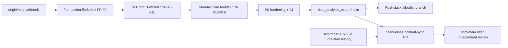

# SCM 当前分支收敛、合并与独立仓发布同步执行计划

> **For agentic workers:** REQUIRED SUB-SKILL: Use `superpowers:executing-plans` to execute this plan task-by-task. 用户已授权计划内 branch / commit / push / PR / merge 自动执行；branch deletion、production deploy 与真实 provider call 仍不在自动授权面。步骤使用 checkbox 追踪。

**Goal:** 在不丢失当前脏工作区资产、不混入无关 monorepo 历史、不绕过 provider/生产边界的前提下，把 SCM 可审计候选链合入 `data_analysis_expert/main`，再以内容同步 PR 更新独立 `scm/main`。

**Architecture:** `data_analysis_expert/main` 作为开发单一事实源，SCM 源码位于 `scm/`；`zjgulai/scm/main` 作为独立发布镜像，不与 monorepo 做 unrelated-history merge。现有 18 个 draft PR 分支按 Foundation / UI Proof / Manual Gate 三个波次重建到全新集成分支，7 月未提交工作另走 post-stack allowlist 分支。

**Tech Stack:** Git、GitHub CLI、CodeGraph、React 19、Vite 7、TypeScript 5、Node 22、`node:sqlite`、Playwright、Docker Compose。

---

## 1. 结论先行

**推荐方案：三波重建 + 两仓分层。不要直接 merge 当前分支，也不要直接 merge `scm/main`。**

1. 开发主线固定为 `origin/main`（`zjgulai/data_analysis_expert`），不是本地 `main`，也不是当前 `codex/scm-readonly-rc-governance-20260629`。
2. 现有 PR #2–#19 是一条线性 stacked chain；按三个评审波次重建，不逐个重复合并 18 次。
3. 当前工作区的 7 月 Loop 文档、SQLite、代码和证据不属于已提交 stack；先保存 allowlist 快照，待前三波合并后另开 post-stack 分支。
4. `scm/main@315775f` 与 monorepo 没有共同祖先，且目录根不同；只能从 `scm/main` 新建内容同步分支，把批准的 prototype 文件映射到独立仓根目录。
5. merge 前必须清除硬阻塞：项目目录内被忽略的 `DDDD.pem`、provider capability 与 health 声明不一致、独立仓路径不可移植、无 CI/无 review、脏工作区归属不清。
6. 2026-07-16 用户已授权本计划内 merge、commit、push 与 PR 修改自动执行；branch 删除、生产 deploy 与真实 provider call 继续排除。

定性把握：**高**。依据是新鲜 Git/GitHub 只读拓扑、CodeGraph 索引、提交归档构建和本地只读 smoke；生产运行态未在本轮重新验收。

## 1.1 当前执行断点（2026-07-16）

- Foundation PR #21 已以 merge commit `fd9f55d4a76f82c992911bca19bfa660af27f75a` 合入 `main`。
- UI Proof PR #20 已以 merge commit `c3f69685de0e220ae99f47b7629cf6a33b9a106e` 合入 `main`。
- Manual Gate PR #22 已以 merge commit `71017000f25b38b539abd2ba3e002ebc89ae5c71` 合入 `main`；3 个 manual gates 仍保持 pending。
- fresh `main` 已通过 `npm ci`、`check`、`build`、72 项 preprod、API/UI/readonly smoke、SQLite restore/hash 与两套 Compose config；`provider_call=false`、`production unchanged`。
- Docker image build 在拉取 `node:22-bookworm-slim` metadata 时被本机腾讯镜像 `EOF` 阻塞；项目 Dockerfile 尚未开始执行，不归类为代码回归。
- 当前执行分支为 `codex/scm-post-stack-loop-assets-20260716`，仅移植 frozen allowlist。

## 2. 审计基线（2026-07-16）

### 2.1 CodeGraph 与项目结构

| 项目 | 当前证据 |
|---|---|
| `codegraph init .` | 已初始化；命令正常返回，不重复创建。 |
| `codegraph sync .` | fresh `main` 成功；再次执行返回 `Already up to date`。 |
| `codegraph status` | 45 files / 2,040 nodes / 4,522 edges，index up to date。 |
| 主要前端 | `src/main.tsx` + 14 个 TSX panel + 6 个 TS model/shared 文件。 |
| 主要后端 | `server/index.mjs`，Node HTTP server + SQLite；当前约 4,596 行。 |
| API 面 | 静态扫描约 46 个 GET、18 个 POST、2 个 HEAD 分支。 |
| 高影响点 | 前端 `api()` 影响至少 20 个符号；`main.tsx` 仍是集成中心。 |

CodeGraph 不索引 Markdown、SQLite、Excel 与大部分证据资产，因此合并判断同时依赖 Git tree、文档、SQLite 只读检查和 smoke，不能只看代码图。

### 2.2 双远端事实

| 远端 | 主线 | 事实 | 处理 |
|---|---|---|---|
| `origin` = `zjgulai/data_analysis_expert` | `origin/main@a680ed1` | 当前 PR #2–#19 所在仓库；SCM 以 `scm/` 子目录进入。 | 开发单一事实源。 |
| `scm` = `zjgulai/scm` | `scm/main@315775f` | PR #1 已于 2026-06-18 merged；主线只有独立仓根目录内容。 | 发布镜像，只做内容同步 PR。 |

`git merge-base scm/main <任何 origin SCM stack 分支>` 不存在。禁止使用 `--allow-unrelated-histories`，否则会同时引入根目录冲突、重复历史和错误路径层级。

### 2.3 分支与 PR 拓扑



| 波次 | 提交范围 | 现有 PR | 当前规模 | 说明 |
|---|---|---|---:|---|
| A Foundation | `origin/main..f5c6a0c` | #2 | 128 files / +38,307 | 最小 read-only RC 基础，但仍需 P0 安全与可移植性加固。 |
| B UI Proof | `f5c6a0c..38a9368` | #3–#11 | 22 files / +30,181 / -92 | UI token、页面 proof 和相关证据；不与 Foundation 混审。 |
| C Manual Gate | `38a9368..feafdf3` | #12–#19 | 53 files / +6,770 / -1 | owner packet、receipt、fixture、validator 与验收矩阵。 |

GitHub 当前显示 #2–#19 均为 draft / `CLEAN`，但 `statusCheckRollup=[]`、无 review decision，且 `main` 未配置 branch protection。`CLEAN` 只证明 GitHub 当前可合并，不证明质量或边界已验收。

### 2.4 当前工作区事实

| 项目 | 数量/状态 |
|---|---|
| 当前分支 | `codex/scm-readonly-rc-governance-20260629@8f1df3d`，对应 PR #1 已关闭。 |
| 全仓 `git status --short` | 135 entries；`-uall` 展开为 155 files。 |
| `scm/` 范围 | 默认 61 entries；`-uall` 展开为 81 files（10 D / 6 M / 65 untracked）。 |
| 当前 SQLite | 35,053,568 bytes；worktree blob 与 HEAD/f5/feaf committed blob 不同。 |
| 忽略密钥文件 | `DDDD.pem` 在项目目录内并被 `.gitignore` 忽略；preprod secret scan 已将其列为 hard blocker。 |
| 既有 worktree | stack tip worktree 记录为 prunable；ledger branch 另有有效 worktree。未经确认不 prune、不 remove。 |

当前分支相对 `feafdf3` 还包含大量 monorepo skills、原始数据和历史资产；它不是 stack tip 的替代分支。任何 `git merge HEAD` 或将本地 `main` 整体推到 `origin/main` 都会重新引入约 2M 行级别的无关历史面。

### 2.5 新鲜验证

| 对象 | 验证 | 结果 |
|---|---|---|
| 当前脏工作区 | `npm run check` | passed。 |
| 当前脏工作区 | `npm run build` | passed；46 modules transformed。 |
| 当前脏工作区 | `npm run smoke:readonly` | passed；仅 GET/HEAD；SQLite SHA-256 前后相同。 |
| 当前脏工作区 | `preprod:check` | **failed**：`DDDD.pem` hard blocker；manual gates 3；dirtyCount 135。 |
| Foundation `f5c6a0c` clean archive | `npm ci / check / build / preprod / diff --check` | passed；preprod hard blockers 0，manual gates 3。 |
| Final stack `feafdf3` clean archive | `npm ci / check / build / preprod / smoke:readonly / diff --check` | passed；SQLite hash unchanged；manual gates 3。 |
| Dependency audit | `npm ci` | 1 low severity advisory；未自动修改 lockfile。 |

说明：clean archive 不是 Git checkout，因此 `preprod:check` 的 dirtyCount 为 `-1`；这不等于“工作区 clean”。提交对象完整性由 `git archive` 和提交 SHA 保证，最终合并候选仍需在真实 clean clone 中复跑。

## 3. P0 合并阻塞与处理规则

### P0-1：忽略密钥仍在项目目录

- 事实：`DDDD.pem` 不在 Git index，但存在于 scan root。
- 风险：误打包、终端输出、备份或容器上下文泄漏；`.gitignore` 不能替代密钥治理。
- 处理：由 Owner 把密钥迁出仓库树，确认新路径权限；本计划不读取、不移动、不删除该文件。
- Gate：`find <candidate-root> -type f \( -name '*.pem' -o -name '*.key' \) -print` 必须为空。

### P0-2：provider capability 与 health 边界声明不一致

- 事实：`GET /api/deploy/health` 固定返回 `providerCalls=false`；但只要 server 存在 `DEEPSEEK_API_KEY`，`POST /api/ai-chat/deepseek` 即可发起真实 provider call。
- 风险：read-only RC 对外声明与实际 capability 不一致；客户端 smoke 的授权变量不能保护服务端 endpoint。
- 处理：在 server 增加默认关闭的 server-side authorization gate，并让 health/status 动态暴露 capability；preprod 必须断言 read-only release 下 gate 为 false。
- Gate：即使测试环境注入假 key，只要 authorization flag 缺失，POST 必须在网络调用前 fail closed。

建议最小实现契约：

```js
const providerCallsAuthorized = envFlag("SCM_DEEPSEEK_PROVIDER_CALL_AUTHORIZED", false);

if (!providerCallsAuthorized) {
  const error = new Error("DeepSeek provider call is not authorized in this runtime.");
  error.statusCode = 403;
  throw error;
}
```

`getDeepSeekStatus()` 和 `getDeployHealth()` 必须返回 `providerCallsAuthorized`，不得继续硬编码与 capability 不一致的 `providerCalls=false`。

### P0-3：独立仓路径不可移植

- 事实：monorepo server 使用 `resolve(root, "../../../tmp/outputs/...")`；把 prototype 直接复制到独立仓根目录会解析到仓库外部。
- 处理：引入明确 env/path contract，例如 `SCM_PROJECT_ROOT` 与 `SCM_AI_KNOWLEDGE_EVIDENCE_PATH`；独立仓把运行期证据放入受控 `data/evidence/`。
- Gate：同一提交必须在 monorepo layout 与 standalone-root layout 两次 clean build + readonly smoke 通过。

### P0-4：当前工作区资产无原子归属

- 事实：tracked deletion、runtime code、SQLite、Loop docs、provider evidence、Amazon/补发业务稿和 skills lock 同时存在。
- 处理：禁止 `git add -A`、禁止 stash-all、禁止在当前分支直接 commit。先产出逐文件 allowlist 与 hash，再在 fresh clone 分批移植。
- Gate：每个候选 commit 的 staged path 必须全部命中该批 allowlist，blocked path 为 0。

### P0-5：二进制 SQLite 分叉

- 事实：HEAD/f5/feaf 的 committed DB blob 相同；当前 worktree DB blob 已变化，虽然 `PRAGMA integrity_check=ok`。
- 处理：先导出 deterministic migration/seed/ledger delta；只有在“可重建 DB + hash + rollback + smoke restore”成立时才允许更新 binary DB。
- Gate：禁止仅以“文件大小相同”或“本地 smoke 通过”批准 binary DB 替换。

### P0-6：文档编号碰撞

stack 已提交 `53`–`70`；当前未提交资产又使用 `53`–`73`。post-stack 移植前必须执行以下重编号：

| 当前未提交编号 | 合并后编号 | 内容 |
|---:|---:|---|
| 53 | 71 | SCM business value / investment case |
| 54 | 72 | Loop Engineering 总计划 |
| 55–73 | 73–91 | Loop 2–20 执行记录，顺序平移 +18 |
| 本文 | 92 | 分支收敛与合并执行计划 |

重命名后必须全库更新 `related`、正文文件引用、00 index 和证据路径；不得仅改文件名。

## 4. 目标分支与处置矩阵

| 分支/引用 | 处置 | 理由 |
|---|---|---|
| `origin/main@a680ed1` | **目标开发主线** | PR stack 的真实 base；避免本地 main 的大历史污染。 |
| 本地 `main@c1633fe` | 保留、冻结，不整体 merge/push | 相对 `origin/main` ahead 15，约 1,306 files / 2M insertions。 |
| 当前 governance branch | 保留到 WIP 完成取证；不 merge | PR #1 closed，当前 dirty 资产仍需 allowlist。 |
| `f5c6a0c..feafdf3` stack | 重建为三波新分支 | 线性、可审计、clean archive 验证已通过。 |
| `codex/scm-ledger-workbench` | 仅 salvage/reference | 相对本地 main 67 commits；混合 UI、server、SQLite、deploy、provider。 |
| `codex/scm-deploy-20260618` | archive/reference | 与当前 main 无 merge base。 |
| `codex/scm-ledger-workbench-export` | archive/reference | 与当前 main 无 merge base。 |
| `scm/main@315775f` | 独立发布同步 base | 与 monorepo unrelated；从它新建内容同步分支。 |

任何 branch 删除都属于 finishing-a-development-branch 的 discard 操作，必须列出 commits/worktree 并获得用户明确确认；本计划默认全部先保留。

## 5. 执行 TODO

### Task 0：冻结现场与确认单一事实源

**Files:** 不修改项目文件；只生成外部审计快照。

- [x] **Step 0.1：记录最新远端引用**

```bash
git fetch --all --prune --tags
git for-each-ref --sort=-committerdate \
  --format='%(refname:short)|%(objectname)|%(upstream:short)|%(subject)' \
  refs/heads refs/remotes
```

Expected：`origin/main`、`scm/main`、PR heads 与本计划基线一致；若 SHA 漂移，停止并重做差异审计。

- [x] **Step 0.2：Owner 确认仓库职责**

Decision：`data_analysis_expert/main` = development source of truth；`scm/main` = standalone release mirror。

Expected：有明确审批记录；未确认时不创建 integration branch。

- [x] **Step 0.3：冻结 merge/deploy 边界**

记录：`production unchanged`、`provider_call=false`、`database_write=false`、`live_send=false`、`merge_executed=false`。

### Task 1：密钥与工作区隔离

**Files:** 不读取密钥内容；不在仓库内创建 secret 副本。

- [x] **Step 1.1：Owner 迁移忽略密钥**

Expected：`DDDD.pem` 不再位于 `<repo-root>/scm/` 或其子目录；权限由 Owner/Ops 复核。

- [x] **Step 1.2：复跑 secret scan**

```bash
find "$(git rev-parse --show-toplevel)/scm" -type f \
  \( -name '*.pem' -o -name '*.key' \) -print
```

Expected：无输出。

- [x] **Step 1.3：保存当前 WIP allowlist**

允许集合仅包括：Loop 资产、`import-assets.mjs`、`smoke-ui.mjs`、`smoke-deepseek-live.mjs`、窄范围 CSS、经批准的 SQLite/migration/evidence。

明确排除：上级仓库删除项、`.baiduyun.uploading.cfg`、`system_data/*`、`skills-lock.json`、Amazon/补发稿、旧 tmp 删除项、`.agents/`、`.codegraph/`、`.playwright-mcp/`。

### Task 2：在 fresh clone 重建三波集成分支

**Branch names:**

- `codex/scm-integration-foundation-20260716`
- `codex/scm-integration-ui-proof-20260716`
- `codex/scm-integration-manual-gates-20260716`

不使用当前 dirty checkout，不复用 prunable worktree。

- [x] **Step 2.1：从 `origin/main` 创建 Foundation 分支**

```bash
git switch -c codex/scm-integration-foundation-20260716 origin/main
git cherry-pick f5c6a0c
```

Expected：只得到 Foundation 128-file candidate，不带本地 main 的 15 个大提交。

- [x] **Step 2.2：为 Foundation 写 failing provider gate smoke**

Test contract：server 有 key 但无 `SCM_DEEPSEEK_PROVIDER_CALL_AUTHORIZED=1` 时，`POST /api/ai-chat/deepseek` 返回 403，且 fake provider server 请求数为 0。

- [x] **Step 2.3：实现 server-side provider gate 与动态 health**

Modify：

- `scm/drafts/prototypes/scm-data-governance-workbench-v0/server/index.mjs`
- `scm/drafts/prototypes/scm-data-governance-workbench-v0/scripts/preprod-check.mjs`
- `scm/drafts/prototypes/scm-data-governance-workbench-v0/scripts/smoke-api.mjs`
- `scm/drafts/prototypes/scm-data-governance-workbench-v0/package.json`

Expected：默认 runtime fail closed；read-only preprod 明确验证 provider capability 关闭。

- [x] **Step 2.4：实现 monorepo/standalone 双布局路径 contract**

Modify：`server/index.mjs` 与 deployment env docs；不得硬编码用户绝对路径。

Expected：证据路径可由 env 覆盖；缺文件时 fail clearly，不默默返回伪成功。

- [x] **Step 2.5：提交 Foundation hardening**

```bash
git diff --check
npm ci
npm run check
npm run build
SCM_PREPROD_SCAN_ROOT="$(git rev-parse --show-toplevel)/scm" npm run preprod:check
```

Expected：hard blockers 0；manual gates 可保持 3，但不能伪完成；provider call 0。

- [x] **Step 2.6：创建 UI Proof 分支并按原顺序移植 9 个提交**

```bash
git switch -c codex/scm-integration-ui-proof-20260716
git cherry-pick a46647f 5750bbc ba0769f f25b936 9f84d9c cc1b444 c493aca 2dc0165 38a9368
```

Expected：冲突为 0；若 hardening 与 UI 产生冲突，停止并逐文件评审，不使用 `-X theirs/ours` 批量吞冲突。

- [x] **Step 2.7：创建 Manual Gate 分支并移植 8 个提交**

```bash
git switch -c codex/scm-integration-manual-gates-20260716
git cherry-pick d2bac24 07a03ac 30c029e 0d492f9 3c218a5 22f1a5c 9b3e8f5 feafdf3
```

Expected：receipt positive fixture 通过、negative fixture fail closed、owner pending 保持 pending。

### Task 3：三波验证与 PR

- [x] **Step 3.1：每个波次运行静态 gate**

```bash
npm ci
npm run check
npm run build
git diff --check
```

Expected：全部 exit 0；`npm ci` 的 low advisory 单独登记，不自动 `npm audit fix`。

- [x] **Step 3.2：在 DB 快照上运行写入型 smoke**

顺序：hash/backup SQLite → `smoke:api` → `smoke:ui` → restore → `smoke:readonly` → hash 对比。

Expected：API/UI smoke 只写临时本地 SQLite；restore 后 hash 与 pre-smoke 相同；`providerCallAttempted=false`。

- [x] **Step 3.3：创建三层 stacked PR**

PR A：Foundation → `main`。

PR B：UI Proof → Foundation branch。

PR C：Manual Gate → UI Proof branch。

Expected：每个 PR 有 Summary、精确 file manifest、验证输出、manual gate 边界和 rollback；先保持 draft。

- [x] **Step 3.4：增加 required checks / review gate**

最低要求：`check`、`build`、preprod、secret scan、readonly smoke、DB integrity/hash、diff check。主线未保护时，禁止只凭 `CLEAN` 手工点击 merge。

- [x] **Step 3.5：逐波合并并 retarget**

1. PR A ready + review + checks 后使用 **merge commit** 合并。
2. 将 PR B base retarget 到 `main`，确认只剩 UI wave，再 merge commit。
3. 将 PR C base retarget 到 `main`，确认只剩 Manual Gate wave，再 merge commit。

禁止 squash/rebase merge：它们会改写 stacked ancestry，使后续 PR diff 膨胀。

- [ ] **Step 3.6：关闭旧 PR #2–#19**

只在新三波 PR 全部 merged 且 post-merge 验证通过后，标记旧 PR 为 superseded；暂不删除 branches。

### Task 4：合并后 clean-main 验证

- [x] **Step 4.1：fresh clone `origin/main`**

Expected：`git status --short` 无输出，目标 merge commit SHA 已记录。

- [x] **Step 4.2：运行完整本地 gate**

```bash
npm ci
npm run check
npm run build
SCM_PREPROD_SCAN_ROOT="$(git rev-parse --show-toplevel)/scm" npm run preprod:check
```

- [x] **Step 4.3：运行 API/UI/readonly smoke 并恢复 DB**

Expected：功能验证通过；provider call 0；production unchanged。

- [x] **Step 4.4：更新 CodeGraph**

```bash
cd scm
codegraph sync .
codegraph status .
```

Expected：index up to date；关键 symbol impact 可查询。

### Task 5：移植 7 月 post-stack WIP

**Branch:** `codex/scm-post-stack-loop-assets-20260716`，base 为已验证 `origin/main`。

- [x] **Step 5.1：执行 53–73 → 71–91 重编号**

Expected：无重复编号；全库旧文件引用为 0；00 index 指向新编号。

- [x] **Step 5.2：Batch D1 导入 preflight**

Files：`import-assets.mjs` + 专用 fixture/test。

Expected：source 缺失时在 SQLite open/write 前 exit 2；env precedence 有测试；授权的 disposable rebuild 必须按固定 allowlist 重放 migrations；不执行真实源资产 import。

- [x] **Step 5.3：Batch D2 UI smoke + CSS**

Files：`smoke-ui.mjs`、窄范围 `styles.css`。

Expected：health 与矩阵回执均锁定当前六场景基线；desktop viewports + interaction smoke；不改 server/API/DB。

- [x] **Step 5.4：Batch D3 Loop 1–6 docs/evidence**

Expected：证据文件通过 schema/hash/secret scan；manual gates 保持 pending；生产只读证据不等于 deploy authorization。

- [x] **Step 5.5：Batch D4 SQLite delta**

Expected：先落 migration/seed/ledger delta，再生成 DB；授权 rebuild 走 base import → allowlisted migrations → integrity/count 验证；`PRAGMA integrity_check=ok`；核心 count 对比有解释；binary DB 可回滚。

- [x] **Step 5.6：Batch D5 Provider Loop 7–20**

Expected：server gate 已在 Task 2 完成；文档和 JSON 不含 secret；POST 一旦发出，失败证据必须保守记录 provider attempt/call，而不能误报 false；本次真实 `provider_call=false` 保持到另行授权；production config scaffold 与 provider acceptance 分开。

- [x] **Step 5.7：Batch D6 其他业务稿**

Amazon refund/reship/补发机器人稿另开 docs-only 分支，不进入 SCM release runtime PR。

**Task 5 当前态对账：** `loop5-release-file-set-manifest-20260701.csv` 仅保留为整合前历史快照；当前候选 tree 以 `loop5-post-stack-reconciliation-20260716.json` 的逐文件 SHA-256 为准，且清单不自哈希。

### Task 6：同步独立 `zjgulai/scm`

**Branch:** `codex/scm-standalone-sync-20260716`，必须从 `scm/main@最新` 新建。

- [ ] **Step 6.1：建立明确映射 manifest**

Source：`data_analysis_expert/main:scm/drafts/prototypes/scm-data-governance-workbench-v0/`

Target：`zjgulai/scm` 仓库根目录。

默认不复制：monorepo analysis series、`system_data/`、`.agents/`、`.codegraph/`、`.playwright-mcp/`、未批准 `tmp/outputs/`、任何 secret。

- [ ] **Step 6.2：保留独立仓历史文件或给出删除决策**

独立仓当前 9 个旧 implementation docs 不在 monorepo prototype 中；删除、迁移到 `archive/` 或保留必须逐项决定，禁止同步工具自动删除。

- [ ] **Step 6.3：执行 content sync，不做 Git history merge**

Expected：基于 `scm/main` 的普通 content diff；不使用 `--allow-unrelated-histories`、force push 或 subtree history rewrite。

- [ ] **Step 6.4：standalone layout 验证**

```bash
npm ci
npm run check
npm run build
SCM_PREPROD_SCAN_ROOT="$(pwd)" npm run preprod:check
```

再运行本地 API/UI/readonly smoke；证据路径必须全部在 standalone-root contract 内。

- [ ] **Step 6.5：创建 standalone sync PR**

Expected：runtime/source diff、data/evidence diff、旧 docs 处置分开说明；独立 review 通过后才 merge。

### Task 7：分支与 worktree 收尾

- [ ] **Step 7.1：先保留所有旧分支**

保持至少到 origin post-merge + standalone sync 双重验收完成。

- [ ] **Step 7.2：输出可删除候选清单**

包括 branch SHA、是否 merged、唯一 commits、worktree 路径、远端 PR 状态。

- [ ] **Step 7.3：请求明确 discard 确认**

没有用户明确确认，不执行 `git branch -D`、远端 branch delete、`git worktree remove` 或 `git worktree prune`。

## 6. Merge Gate 矩阵

| Gate | Source merge | Standalone sync | Deploy |
|---|---:|---:|---:|
| Secret scan 0 hit | required | required | required |
| Clean checkout | required | required | required |
| `npm run check/build` | required | required | required |
| Preprod hard blockers 0 | required | required | required |
| Manual gates 3 | 可列账，不伪完成 | 可列账，不开放写/provider | 未完成则只读能力上限 |
| API/UI smoke + DB restore | required | required | required |
| Readonly smoke hash unchanged | required | required | required |
| Provider server gate default false | required | required | required |
| Required CI + review | required | required | required |
| Merge authorization | required | required | N/A |
| Deploy authorization | N/A | N/A | **separate explicit approval** |
| Production smoke | N/A | N/A | post-deploy only |

## 7. 回滚策略

1. 每波使用 merge commit，记录 merge SHA。
2. 合并后失败时，用 `git revert -m 1 <merge-commit>` 逆序回滚；禁止 reset/force push 主线。
3. standalone sync 单独 revert，不影响 monorepo main。
4. binary SQLite 在测试和 deploy 前做 hash + snapshot；恢复后复核 hash 和 `PRAGMA integrity_check`。
5. deploy 不属于本计划自动执行面；如后续获批，应用/Compose/DB 三层回滚必须分别有证据。

## 8. 停止条件

命中任一项立即停止当前批次：

- 远端 SHA 或 PR base 漂移，导致本计划 commit range 不再成立。
- secret scan 非零。
- provider endpoint 在授权 flag 缺失时仍可触发网络调用。
- cherry-pick 冲突涉及 server、SQLite、deploy 或 boundary 语义。
- staged path 命中 allowlist 之外的文件。
- API/UI smoke 后 SQLite 无法恢复原 hash。
- `npm run check/build`、preprod hard gate 或 required CI 失败。
- 需要 merge、push、PR 修改、production config、deploy、restart 或 provider call，但没有对应单独授权。

## 9. 当前未完成事项

- post-stack branch 尚待最终 gate、PR、独立 review 与 merge。
- `zjgulai/scm` standalone content sync 尚未执行。
- 旧 PR #2–#19 尚待标记 superseded；旧 branches 继续保留。
- 3 个 manual gates 仍 pending，不伪造 owner signoff、field mapping 或 SCEI 权重批准。
- Docker image build 仍被本机腾讯镜像 metadata `EOF` 阻塞；Compose config 已通过。
- 未 deploy、未调用 provider、未写生产；`production unchanged`、`provider_call=false`。
