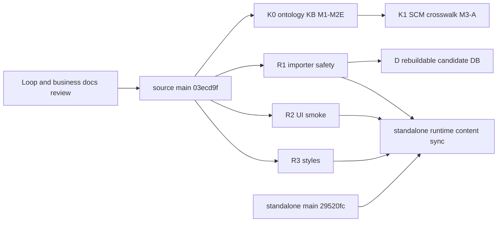

# SCM 合并完成后的 WIP 收敛与本体知识库集成执行计划

> **For agentic workers:** REQUIRED SUB-SKILL: Use `executing-plans` to execute this plan task-by-task. 每个 Gate 均需保存新鲜证据；commit、push、PR、merge、独立仓同步、数据库写入、provider 调用和 deploy 是彼此独立的授权边界。

**Goal:** 在保留当前脏工作区现场的前提下，把原始分支合并完成后新增的可信资产按最小可审阅单元收敛到源仓 `data_analysis_expert/main`，并仅对已合并的运行时改动执行独立仓内容同步。

**Architecture:** `zjgulai/data_analysis_expert/main` 继续作为开发单一事实源，SCM 位于 `scm/`；`zjgulai/scm/main` 是无共同祖先的独立发布镜像，只接收已批准的运行时文件内容同步。当前脏分支只作为候选资产来源，不直接 merge、不整体 stash、不整体 stage。知识库文档、SCM crosswalk、运行时代码、SQLite 数据和历史证据分别进入不同分支与门禁。

**Tech Stack:** Git、GitHub CLI、Node.js、JSON/JSONL、Markdown、SQLite、React、Vite、TypeScript，以及知识库 M1–M2E 构建/验证工具。

---

## 1. 结论先行

原始“合并当前项目分支”的主目标已经完成，不应重新执行旧计划的分支栈合并：

| 层级 | 2026-07-18 新鲜只读证据 | 结论 |
|---|---|---|
| 源仓主线 | `zjgulai/data_analysis_expert/main@03ecd9f41f67ccd5ef15d0d6834e241fcaa504f5` | PR #26、#27 的结果已进入主线。 |
| 独立仓主线 | `zjgulai/scm/main@29520fc10dbd12fc14268d98dbb8f9b3f3f6ee38` | 独立仓 PR #3 已合并。 |
| 开放 PR | 两仓 `gh pr list --state open` 均为 `[]` | 没有待续接的旧 PR。 |
| 当前工作区 | `codex/scm-readonly-rc-governance-20260629@8f1df3d`，大量跨域修改/删除/未跟踪文件 | 不能直接 merge，也不能 `git add -A`。 |
| clean clone | `ecom_ana_overview_scm_cleanmain_20260716` 工作区干净，现有分支 head 已被源仓主线包含 | 可复用为下一批隔离执行环境。 |

因此下一目标由“继续合并旧分支”切换为“**post-merge WIP 收敛**”。推荐顺序：

1. Gate 0：刷新两仓远端基线并冻结当前 WIP 清单。
2. Wave K0：先入库已完成验证的本体知识库 M1–M2E 资产，仅 docs/manifests/tools。
3. Wave K1：在独立分支完成 M3-A 只读 SCM crosswalk 设计与候选报告。
4. Wave R：按 importer、UI smoke、样式三个关注点分别审查运行时修改。
5. Wave D：SQLite 只通过可重复 migration/seed 进入候选库，不提交当前二进制数据库。
6. Wave E：旧 Loop、provider、Amazon/SOP 等资产逐组判定归属，不混入 K0/K1。
7. 只有源仓运行时 PR 合并后，才创建独立仓内容同步 PR；知识库分析文档不下发独立仓。

定性把握：**高**。两仓主线 SHA、开放 PR、当前 Git 现场和知识库本地验证均有新鲜只读证据；尚未执行任何本计划中的写操作。

## 2. 不可突破的执行边界

- 禁止在当前脏工作区直接 merge、rebase、commit、stash-all、clean、reset 或 prune。
- 禁止 `git add -A`、`git add .` 和按整个 `scm/` 目录 stage；只能使用每个 Wave 的显式 allowlist。
- 禁止使用 `--allow-unrelated-histories` 连接源仓与独立仓。
- 禁止把当前 `governance_workbench.sqlite` 作为 WIP 搬入新分支。
- 禁止在 K0/K1 调用 importer、写 SQLite、调用 provider 或写生产系统。
- 禁止提交附件 PDF、完整抽取文本、整页截图、本机绝对路径、token、key、`.env` 或其他敏感材料。
- commit、push、创建 PR、merge、独立仓同步和 deploy 分别记录；前一步通过不自动授权后一步。
- 当前脏工作区在全部候选成果进入主线并完成复核前不得清理。

## 3. 资产分流设计

| Lane | 当前候选 | 目标 | 是否同步独立仓 |
|---|---|---|---|
| K0 知识库基线 | `ontology-ai-data-management-knowledge-base-draft-20260718/**`、知识入库总计划、本计划 | 源仓 docs/manifests/tools PR | 否 |
| K1 SCM crosswalk | 后续 `07-scm-crosswalk/**`、relation/crosswalk manifest、只读报告 | 源仓 docs-only PR | 否 |
| R1 importer | `scripts/import-assets.mjs` | 安全 importer PR；稳定 ID、显式事务、candidate DB、回滚 | 源仓合并后再同步 |
| R2 验收工具 | `scripts/smoke-ui.mjs` | 独立测试工具 PR | 视运行时需要同步 |
| R3 UI | `src/styles.css` | 独立 UI PR | 源仓合并后再同步 |
| D 数据库 | `data/governance_workbench.sqlite` | 不搬二进制；转为 migration/seed/ledger | 仅审核后的可重建制品 |
| E1 Loop 历史 | 本地 53–73、Loop 2–20 outputs、provider smoke | 先语义对照、证据审查和敏感扫描 | 默认否 |
| E2 业务文档 | Amazon refund/reship、补发 SOP | 独立 docs-only PR | 否 |
| X 无关变更 | 父仓删除、skills dist、`skills-lock.json`、系统/临时文件 | 全部排除 | 否 |

### 3.1 旧编号文档判定

源仓 `main` 已存在编号 71–91 的 Loop 文档以及 92 号合并计划；当前未跟踪的 53–73 与其标题/谱系对应。只读 hash 对比显示：53 与远端 71 完全相同，其余文件存在差异，不能简单称为逐字重复，也不能再次整批导入。

执行策略：

- 53 直接标记为已被主线覆盖，不进入任何新 PR。
- 54–73 逐文件做语义 diff，只保留“主线版本缺失且仍有效”的段落，并以补丁形式进入单独历史修正文档 PR。
- 在语义审查完成前不删除本地副本；删除或归档需单独确认。
- 当前未跟踪的 92 不再导入，因为同路径已存在于源仓主线。

## 4. 分支与依赖拓扑



建议分支名：

- K0：`codex/scm-ontology-kb-m2-20260718`
- K1：`codex/scm-ontology-crosswalk-m3a-20260718`
- R1：`codex/scm-importer-safety-m4-20260718`
- R2：`codex/scm-ui-smoke-followup-20260718`
- R3：`codex/scm-style-followup-20260718`
- 独立仓同步：`codex/runtime-content-sync-after-<source-pr>`

K1 依赖 K0；D 依赖 R1。R1/R2/R3 不依赖 K0，可在资源允许时分别评审，但不得混为一个提交。独立仓同步必须等待相应源仓运行时 PR 已合并。

## 5. 执行 Todo List

### Task 0：刷新基线并冻结 WIP（只读）

**验收：** 两仓 SHA、开放 PR、clean clone 状态和 WIP allowlist 都有带时间戳证据；任何 SHA 漂移均停止并重算计划。

- [ ] 在当前仓库记录源仓和独立仓最新主线：

```bash
gh api repos/zjgulai/data_analysis_expert/commits/main --jq '.sha'
gh api repos/zjgulai/scm/commits/main --jq '.sha'
gh pr list --repo zjgulai/data_analysis_expert --state open --json number,title,headRefName
gh pr list --repo zjgulai/scm --state open --json number,title,headRefName
```

预期基线分别是 `03ecd9f41f67ccd5ef15d0d6834e241fcaa504f5`、`29520fc10dbd12fc14268d98dbb8f9b3f3f6ee38` 和两组 `[]`。不匹配时停止，不沿用旧 SHA。

- [ ] 确认隔离 clone 干净，不自动修复其现场：

```bash
CLEAN_ROOT="$(git -C "$HOME/project/ecom_ana_overview_scm_cleanmain_20260716" rev-parse --show-toplevel)"
test -z "$(git -C "$CLEAN_ROOT" status --porcelain)"
```

- [ ] 从当前脏工作区导出只读清单，按 K0/K1/R/D/E/X 分类；清单必须包含路径、Git 状态、大小、SHA-256 和归属决策。
- [ ] 记录当前 SQLite 基线 hash，但不打开写连接：

```bash
shasum -a 256 drafts/prototypes/scm-data-governance-workbench-v0/data/governance_workbench.sqlite
```

预期当前已知值为 `cb91dd0d63dad2d62d73f7da5c7058254b08ac36feb139921a38121dcf61cc99`；变化则停止并重新审计。

### Task 1：建立 K0 隔离分支

**验收：** 新分支只以新鲜源仓 `main` 为基线，且搬运前工作区为空。

- [ ] 在 clean clone 获取并校验精确主线 commit：

```bash
git -C "$CLEAN_ROOT" fetch origin main
test "$(git -C "$CLEAN_ROOT" rev-parse FETCH_HEAD)" = "03ecd9f41f67ccd5ef15d0d6834e241fcaa504f5"
git -C "$CLEAN_ROOT" cat-file -e 03ecd9f41f67ccd5ef15d0d6834e241fcaa504f5^{commit}
```

- [ ] 从精确 SHA 创建 K0 分支：

```bash
git -C "$CLEAN_ROOT" switch -c codex/scm-ontology-kb-m2-20260718 03ecd9f41f67ccd5ef15d0d6834e241fcaa504f5
test -z "$(git -C "$CLEAN_ROOT" status --porcelain)"
```

- [ ] 若该分支名已存在，停止并审计，不用 `-C` 覆盖分支。

### Task 2：按 K0 allowlist 搬运知识库成果

**允许路径仅有：**

```text
scm/drafts/analysis/ontology-ai-data-management-knowledge-base-draft-20260718/**
scm/drafts/analysis/ontology-driven-ai-data-management-kb-ingestion-plan-draft-20260718.md
scm/drafts/analysis/aip-scm-node-deepdive-optimization-draft-20260627/93-post-merge-wip-reconciliation-and-ontology-kb-integration-plan-draft-20260718.md
```

- [ ] 先执行 `rsync --dry-run --itemize-changes`，确认输出只有上述路径；不得使用 `--delete`。
- [ ] dry-run 通过后，以同一 allowlist 搬运到 clean clone。
- [ ] 父仓 `.gitignore` 的通用 `tools/` 规则会忽略知识库内 12 个 `.mjs` 构建/验证脚本；不得遗漏这些文件，也不得为本任务放宽全局 ignore。搬运后用 `find "$KB_ROOT/tools" -type f -name '*.mjs' | wc -l` 明确验证数量为 12。
- [ ] 检查没有 PDF、原始全文、整页图片、绝对源路径或临时输出：

```bash
git -C "$CLEAN_ROOT" status --short
rg -n '/Users/|桌面 - Pray|BEGIN (RSA |OPENSSH )?PRIVATE KEY|sk-[A-Za-z0-9]{20,}' \
  "$CLEAN_ROOT/scm/drafts/analysis/ontology-ai-data-management-knowledge-base-draft-20260718" \
  "$CLEAN_ROOT/scm/drafts/analysis/ontology-driven-ai-data-management-kb-ingestion-plan-draft-20260718.md"
find "$CLEAN_ROOT/scm/drafts/analysis/ontology-ai-data-management-knowledge-base-draft-20260718" \
  -type f \( -iname '*.pdf' -o -iname '*.png' -o -iname '*.jpg' -o -iname '*.jpeg' \) -print
```

预期两条扫描均无输出。命中时停止并人工判定，不能用自动替换掩盖敏感信息。

### Task 3：K0 结构与内容验证

**验收：** 资产可解析、工具可执行、M1–M2E 全链通过、确定性重跑一致、数据库 hash 不变。

- [ ] 对全部 JSON、JSONL 和 Node 工具做静态验证：

```bash
KB_ROOT="$CLEAN_ROOT/scm/drafts/analysis/ontology-ai-data-management-knowledge-base-draft-20260718"
find "$KB_ROOT" -type f -name '*.json' -exec jq empty {} \;
find "$KB_ROOT" -type f -name '*.jsonl' -exec sh -c 'while IFS= read -r line; do printf "%s\n" "$line" | jq -e . >/dev/null || exit 1; done < "$1"' sh {} \;
find "$KB_ROOT/tools" -type f -name '*.mjs' -exec node --check {} \;
```

- [ ] 使用外部附件路径执行 M1 来源验证；PDF 只参与本地校验，不复制到仓库：

```bash
PDF_PATH="$HOME/Desktop/桌面 - Pray.Chow的MacBook Pro/本体驱动的AI数据管理.pdf"
node "$KB_ROOT/tools/verify-m1-source-map.mjs" --pdf "$PDF_PATH" --output-root "$KB_ROOT"
```

- [ ] 顺序执行 `verify-m2a-content.mjs` 至 `verify-m2e-content.mjs`；M2 验证器支持 `--pdf` 时统一传入同一附件。
- [ ] 确认最新质量门槛：151 section records、141 subsections、10 summaries、89 cards、81 terms、155 relations、exact duplicate 0、normalized-title duplicate 0、missing node 0、M2E orphan 0；1 条 `CONTRADICTS` 候选和 30 个视觉复核区间必须保留为待评审项，不能伪装为零风险。
- [ ] 复制验证前后的知识库清单 hash 并比较；执行 build 重跑时必须做到确定性一致。
- [ ] 验证前后分别计算两份 `governance_workbench.sqlite` hash：原始脏工作区 WIP DB 必须保持 `cb91dd0d63dad2d62d73f7da5c7058254b08ac36feb139921a38121dcf61cc99`；源仓 main 基线的 clean clone DB 必须保持 `3d972e46ec43a64ad69265f295af4ffd9039dfe721a0e9f7f22d02e9b7652af7`。两者是不同证据层，不要求相互相等，也不复制或打开写连接。
- [ ] 执行 `git -C "$CLEAN_ROOT" diff --check`。

### Task 4：K0 精确 stage、commit 与 PR Gate

**验收：** staged diff 只包含三条 allowlist，且 PR 描述明确 `docs/manifests/tools-only`、`database_write=false`、`provider_call=false`。

- [ ] 使用三个完整路径分别 `git add -- <path>`；其中仅对已验证的 12 个 `tools/*.mjs` 使用精确 `git add -f -- <12 个路径>`，不修改全局 `.gitignore`。禁止从仓库根执行 `git add .`。
- [ ] 以 `git diff --cached --name-status` 与固定 allowlist 比较；出现任何额外路径立即 unstage 并停止。
- [ ] 本地 Gate 全绿后，建议单一提交：`docs(scm): add ontology knowledge base M1-M2E candidate assets`。
- [ ] commit 是独立授权点；未授权时停在 clean staged diff。
- [ ] push 与创建源仓 PR 是后续独立授权点；PR base 固定 `main`，不得指向独立仓。
- [ ] CI/review 通过后才提出 merge 建议；merge 不自动执行。
- [ ] K0 不创建独立仓同步 PR，因为其内容不属于发布镜像运行时。

### Task 5：K1 执行 M3-A 只读 crosswalk

**验收：** 只生成候选映射，零 importer 修改、零 SQLite 写入、零 active/certified 晋升。

- [ ] 仅在 K0 合并后从最新源仓 `main` 建分支；若必须堆叠评审，base 明确指向 K0 分支并在 K0 合并后 rebase。
- [ ] 新增/修改范围限制为 `07-scm-crosswalk/**`、对应 manifest/report，以及知识入库计划的 M3-A 状态段。
- [ ] 映射模板至少包含：candidate card ID、SCM object/metric/rule ID、relation type、evidence level、source pages、accept/reject/unmapped、conflict reason、reviewer、review status。
- [ ] 证据等级严格区分：书籍观点、项目适用推断、SCM 已验证事实。
- [ ] 对所有候选执行目标存在性、重复映射、冲突、孤儿和反向引用检查。
- [ ] 产出只读报告；默认全部保持 candidate，未获 owner 评审不得晋升。
- [ ] `git diff --check`、敏感路径扫描、精确 allowlist 均通过后，才进入 commit/PR Gate。
- [ ] K1 不同步独立仓，也不触发 M4。

### Task 6：运行时 WIP 分拆审查

**验收：** importer、smoke、CSS 各自有需求、测试和回滚，不互相借绿灯。

- [ ] R1 先为 `import-assets.mjs` 建失败用例，覆盖稳定 ID、长文无截断、显式事务、失败回滚、candidate 域隔离和幂等。
- [ ] R1 只能写新建的 candidate SQLite；先备份、再事务、失败 rollback、最后做 `integrity_check` 与前后 hash/row-count 对账。
- [ ] R2 单独审查 `smoke-ui.mjs` 的行为变化，验证失败路径、退出码、进程清理和超时上界。
- [ ] R3 单独截图或浏览器验收 `styles.css`，同时跑 typecheck/build/UI smoke。
- [ ] 每个关注点建立独立分支和 PR；不能把当前三个修改一次性搬运并提交。
- [ ] 只有源仓对应 PR 合并后，才评估是否需要同步到独立仓。

### Task 7：SQLite 可重建化

**验收：** 不依赖当前二进制数据库也能从明确 baseline 重建同一候选状态，并可回滚。

- [ ] 对当前 SQLite 只读导出 schema、目标表 row count 和候选差异账本，不输出敏感业务数据。
- [ ] 将必要变化表达为 migration、seed 或 manifest 驱动导入，不直接替换 tracked SQLite。
- [ ] 在临时 candidate DB 执行 migration 两次，验证幂等、foreign key、`integrity_check`、回滚和稳定 ID。
- [ ] 对 baseline、candidate、rollback 三个数据库分别记录 SHA-256。
- [ ] 未通过可重复构建前，数据库 lane 保持 blocked，不进入 PR。

### Task 8：历史与旁路资产治理

- [ ] 对 54–73 与主线 72–91 做逐文件语义 diff，形成“主线已有 / 主线缺失 / 已失效 / 需人工判断”矩阵。
- [ ] Loop/provider outputs 先做 secrets/PII 扫描和证据真实性检查；配置字符串、账单状态或旧 JSON 不等于真实 provider 调用成功。
- [ ] `smoke-deepseek-live.mjs` 不得在本计划下执行；任何真实 provider smoke 需要新的精确授权。
- [ ] Amazon refund/reship 与补发 SOP 走独立 docs-only 分支，不混入 SCM runtime 或知识库 PR。
- [ ] 父仓删除、百度云占位文件、skills dist 删除、`skills-lock.json`、`tmp/` 与 `system_data/` 变更全部留在当前现场，不随任何 SCM PR stage。
- [ ] 等所有保留资产进入主线并验收后，再提出当前脏分支/文件清理清单；清理需要单独批准。

### Task 9：独立仓运行时内容同步

**验收：** 只同步已在源仓合并的运行时文件，独立仓历史仍从 `29520fc...` 延续。

- [ ] 重新读取 `zjgulai/scm/main` 最新 SHA；若不是 `29520fc...`，以新 SHA 重算 diff。
- [ ] 从独立仓最新 `main` 新建内容同步分支，不 merge/cherry-pick monorepo commit。
- [ ] 将源仓 `scm/drafts/prototypes/scm-data-governance-workbench-v0/` 中已批准运行时路径映射到独立仓对应根路径。
- [ ] 明确排除 `scm/drafts/analysis/**`、本体知识库、monorepo skills、原始数据和内部计划文档。
- [ ] 在独立仓重新运行 typecheck、build、专项 smoke、provider/database-off 断言和 path-contract；源仓绿灯不能替代独立仓验证。
- [ ] 创建独立 PR 并等待独立 review/check；merge 和 deploy 分开授权。

## 6. Gate 矩阵

| Gate | 必须通过 | 失败动作 |
|---|---|---|
| G0 Baseline | 两仓 SHA 新鲜、无未识别 open PR、clean clone 干净 | 停止并重做拓扑审计 |
| G1 Allowlist | diff/stage 只含本 Wave 路径 | unstage，重新分类 |
| G2 Knowledge | JSON/JSONL/Node、M1–M2E、质量指标、确定性通过 | 停止 K0，不降级门槛 |
| G3 Security | 无 secret、PII、PDF、完整原文、绝对路径 | 隔离命中项并人工审查 |
| G4 DB Boundary | SQLite hash 不变，database write 0 | 停止并追踪写入来源 |
| G5 Provider Boundary | provider request 0 | 停止，保留日志，不重试 |
| G6 Review | CI/check/review 全部完成，人工未决项明确 | 不 merge |
| G7 Standalone | 仅已合并 runtime 内容，独立仓全套验证通过 | 不创建或不合并同步 PR |
| G8 Deploy | 独立部署授权与回滚方案齐备 | production unchanged |

## 7. 停止条件与回滚

出现以下任一情况立即停止当前 Wave：

- 远端 main SHA 与计划基线不一致；
- clean clone 出现非本 Wave 改动；
- allowlist 之外文件进入 diff/stage；
- 知识卡计数、关系完整性或确定性校验退化；
- SQLite hash 变化或发现写连接；
- provider 请求计数非零；
- secrets/PII/绝对路径扫描命中；
- 需要修改 schema、删除数据、执行真实发送或扩展生产权限；
- 同一路径第三次验证仍失败。

回滚策略：

1. PR 前：删除隔离 clone 中本 Wave 分支或恢复其未提交内容；不得触碰原始脏工作区。
2. PR 后未 merge：关闭 PR/保留分支均需明确决定，不自动删除。
3. 源仓已 merge：使用独立 revert PR，不重写 `main` 历史。
4. 独立仓已 merge：在独立仓创建对应 revert PR，不回滚源仓无关内容。
5. 数据库：只恢复已记录 hash 的备份或重建 baseline；禁止手工编辑二进制数据库补救。

## 8. 下一批推荐执行范围

下一批只执行 **Task 0–Task 3**：刷新基线、建立 K0 分支、按 allowlist 搬运、完成全部本地验证。到达以下检查点后暂停汇报：

```text
source_commit_created=true
staged_paths=180
push_created=false
pull_request_created=false
merge_executed=false
standalone_sync_executed=false
database_write=false
provider_call=false
production_unchanged=true
```

检查点交付物应包含：新鲜远端 SHA、K0 分支名、精确 diff 清单、知识库验证结果、SQLite 前后 hash、未决视觉复核/冲突项，以及是否建议进入 Task 4 commit Gate。

## 9. 完成定义

只有同时满足以下条件，才可称“合并后 WIP 收敛完成”：

- K0 知识库资产已通过源仓 review 并合并；
- K1 crosswalk 已通过 owner 评审或明确保持 candidate；
- R/D/E 各资产均已合入、明确拒绝或有可追踪的延期决策；
- 当前脏工作区不存在尚未分类的 SCM 资产；
- 需要发布的运行时变化已通过独立仓内容同步 PR；
- deploy、provider 调用和生产写入状态按实际证据单独报告；
- 原始脏工作区仅在全部证据复核并获得清理授权后处理。

在此之前，准确表述应是：“原始双仓合并链已完成；post-merge WIP 正在分批收敛”，不能笼统称整个当前工作区已经合并完成。

## 10. 2026-07-18 K0 Task 0–3 执行检查点

### 10.1 Gate 0 与隔离分支

- 源仓主线仍为 `03ecd9f41f67ccd5ef15d0d6834e241fcaa504f5`，独立仓主线仍为 `29520fc10dbd12fc14268d98dbb8f9b3f3f6ee38`，两仓 open PR 均为零。
- WIP 冻结为 337 条：K0 180、R1/R2/R3 各 1、D 1、E 65、X 88；完整清单字段为 decision/status/size/SHA-256/path，指纹为 `34c4e479813717ddbe3011c93b003cbf2fd2fe170efd365a3625a128e39aed3c`。
- K0 清单 180 条，包含 178 个知识库文件和 2 个计划文件；其中 12 个 `tools/*.mjs` 被父仓通用 ignore 规则隐藏。K0 指纹为 `074a3625fa34660ebd382574c4e1b9ff14e05faf892dbf9c6a8f6bdbdc4b5b4b`。
- clean clone 的 Git HTTPS fetch 未填充 `FETCH_HEAD`。本次未使用陈旧 remote-tracking ref，而是以 GitHub API 新鲜精确 SHA 加本地 `cat-file` commit 对象双重确认基线。
- 已从该精确 SHA 创建 `codex/scm-ontology-kb-m2-20260718`；当前没有 commit、push、PR 或 merge。

### 10.2 Allowlist 与安全边界

- 仅搬运知识库目录、知识入库总计划和本 93 号计划，共 180 个文件；源与目标逐字一致。
- 知识库内 178 个文件和 12 个工具脚本齐全；Git 可见 168 条，另有 12 条 ignored tools。
- 严格扫描未发现本机绝对路径、附件桌面路径、私钥标记或长 token 模式；PDF/整页图片为 0，异常扩展为 0，allowlist 外状态为 0。

### 10.3 新鲜验证结果

| 验证 | 结果 |
|---|---|
| JSON / JSONL | 51 个 JSON、2 个 JSONL、306 条 JSONL 记录全部可解析。 |
| Node 静态检查 | 12 个 `.mjs` 全部通过 `node --check`。 |
| M1 | 211 页、4 篇、10 章、46 节、141 小节；来源 SHA-256 为 `462dd347c6361ddb2d6bacf98103d053e9d9106f2105fee0600d2a2fbce2be35`。 |
| M2-A 至 M2-E | 全部 verifier 通过，均报告 `stable_ids=true`、`deterministic_rerun=true`、`database_write=false`、`provider_call=false`。 |
| 全书质量 | 151 section records、141 substantive subsections、10 summaries、89 cards、81 terms、155 relations；missing/uncovered/orphan/exact duplicate/normalized-title duplicate 均为 0。 |
| 人工未决 | 1 条显式 `CONTRADICTS` 候选、30 个 pending visual review spans，继续保持 manual review。 |
| KB 确定性 | 178 文件，重建前后树指纹均为 `2f46102b941eba8b35475b805eaa2cbd1ce9277ba8eec97b505b6acdadf9f994`。 |
| DB 边界 | 脏工作区 DB 前后均为 `cb91dd0d...cc99`；clean main DB 前后均为 `3d972e46...2af7`。两者未复制、未写入。 |

### 10.4 当前授权边界

```text
source_commit_created=false
push_created=false
pull_request_created=false
merge_executed=false
standalone_sync_executed=false
database_write=false
provider_call=false
production_unchanged=true
```

Task 4 的精确 stage 已获授权并执行；本地 commit 仍是独立授权点。

### 10.5 Task 4 staged 检查点

- 已按三条 K0 allowlist stage 180 个文件；其中 12 个 `tools/*.mjs` 通过逐路径 `git add -f` 纳入，没有修改 `.gitignore`。
- staged 文件集合与“178 个知识库文件 + 知识入库总计划 + 本计划”精确相等；allowlist 外路径、未 stage 路径和未跟踪路径均为 0。
- `git diff --cached --check` 通过；staged 资产为 115 Markdown、51 JSON、2 JSONL、12 MJS，全部是新增文本文件，二进制、数据库、prototype runtime 和禁止文件类型均为 0。
- staged 与 worktree 一致时重新完成 51 JSON、2 JSONL/306 条记录、12 MJS 静态检查以及 M1、M2-A 至 M2-E 全链验证；确定性、数据库和 provider 边界保持不变。
- cached 内容中的 5 个 `/Users/` 字面量仅存在于 verifier 的“拒绝个人绝对路径”自检断言；知识数据与知识入库计划中的真实绝对路径命中为 0。
- 本地原子 commit 使用 `docs(scm): add ontology knowledge base M1-M2E candidate assets`；未创建远端分支或 PR。

### 10.6 本地原子 commit 授权

- 用户已明确授权提交信息：`docs(scm): add ontology knowledge base M1-M2E candidate assets`。
- 本计划与 178 个知识库文件、知识入库总计划共同进入同一个本地原子 commit；具体 commit SHA 以 Git 提交结果为准。
- 本次授权不包含 push、远端分支、PR、merge、独立仓同步或 deploy，相关 boundary 继续保持 `false`。
