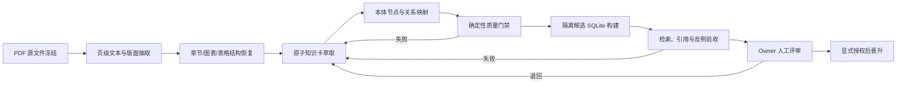

# 《本体驱动的 AI 数据管理》内容萃取与知识库入库方案

## 1. 当前结论

推荐采用“源文件冻结 → 页级结构化抽取 → 原子知识卡 → 本体关系层 → 隔离候选库 → 检索与引用验收 → 人工晋升”的完整链路。

现已按批准完成 M1 与 M2-A 至 M2-E：全书第 1–10 章的 141 个三级正文小节和 10 个章末小结均已形成 151 条来源记录；PR 评审修正后聚合为 89 张知识卡、81 个术语和 154 条候选关系，并输出全书覆盖与图谱质量报告。PR #28 已合并到 `main`，合并提交为 `e99f7089791b31891a7b5bb9cc352f161852c8e3`。M3-A 已在该提交派生的本地分支生成 candidate-only SCM crosswalk：原始快照保持 6 张 `accept_candidate`、3 张 `reject_candidate`、80 张 `unmapped`；2026-07-19 用户授权的 `owner-delegated-codex` 语义评审已完成 13 条边的 0 approved / 12 rejected / 1 deferred，但这不是人类 owner 亲自签字，也不构成 SCM verified 或 active/certified 晋升。截至 2026-07-20，M3-A candidate asset commit `dc56a773a7685d6f310612e7d046ee3546a29791` 已 push 至 PR #29，PR 保持 open、尚未 merge。自动证据覆盖 Git scope、覆盖层记录状态与 SQLite 只读哈希门禁；知识库导入、工作台 provider 调用和 active/certified 晋升仅记录为本批未执行声明，不由 builder 独立验证。第 13 节另行保留 M2-E 首次内容完成时的 49/155 历史快照。

不建议直接执行现有 `npm run import`，原因如下：

1. 当前 importer 只遍历 Markdown，不能保留 PDF 页码、图表、表格和版面证据。
2. 每个 Markdown 以文件排序序号生成卡片 ID，插入或改名文件会导致 ID 漂移。
3. 每个文件最多截取 4 个 900 字符 chunk，长章节会丢失大量内容。
4. importer 会先删除并重建 29 张表，当前实现没有显式事务包裹。
5. 当前预检因核心指标蓝图源目录缺失而处于 `blocked_source_required`。
6. 当前 SQLite 虽通过 `integrity_check`，但知识卡全部保存本机绝对路径，无法作为可移植来源标识。

## 2. 附件只读审计

### 2.1 文件事实

| 项目 | 结果 |
|---|---|
| 标题 | 本体驱动的 AI 数据管理 |
| 作者 | 《本体驱动的 AI 数据管理》编写组 |
| PDF 页数 | 211 |
| 文件大小 | 15,917,846 bytes |
| SHA-256 | `462dd347c6361ddb2d6bacf98103d053e9d9106f2105fee0600d2a2fbce2be35` |
| 文本层 | 存在，可直接检索；抽取文本约 503 KB |
| 图像复杂度 | `pdfimages` 检出 122 个 image/mask 对象 |
| 空文本页 | 2 页；另有 1 页低于 100 个非空白字符 |
| 加密 | 否 |
| JavaScript | 否 |

### 2.2 内容骨架

全书分为四篇、十章：

1. 战略认知：智能时代业务管理、数据治理重塑、统一结构化表达。
2. 核心理论：本体思想演进、事实—事理—行动、面向 AI 的数据资产和“7+1”语义规范。
3. 落地实施：预处理—建模—入库—平台—实施五环、29 句话、双模型校验、资产运营、AI Agent 工程和应用模式。
4. 未来展望：智能体可信治理、多模态本体、世界模型和智能原生企业。

### 2.3 抽取策略判断

该 PDF 适合以文本层为主、视觉复核为辅：

- 标题、段落和大部分列表可直接从文本层抽取。
- 图、表、流程框架不能只依赖 `pdftotext`，需渲染页面并记录图号、表号、图题和人工复核状态。
- 空文本页和低文本页必须进入页面覆盖报告，不能静默跳过。
- 书中案例需区分“作者案例”“本项目适用推断”“已在 SCM 业务验证”三种证据等级。

## 3. 目标与非目标

### 3.1 目标

1. 建立可追溯到 PDF 页码和章节的派生知识资产。
2. 将核心概念、原则、方法、流程、控制规则、角色、制品和应用模式拆成原子知识卡。
3. 建立知识卡之间及其与 SCM 对象、指标、规则之间的候选关系。
4. 在不污染现有 active 供应链证据的前提下，形成可检索、可引用、可回滚的候选知识域。
5. 为后续本体建模、AI Agent 场景设计和数据治理决策提供稳定输入。

### 3.2 非目标

- 不复制或公开分发完整书稿、整页图片或大段原文。
- 不把书中观点直接标记为本企业已验证事实。
- 不自动晋升为 active/certified 证据。
- 不调用 DeepSeek 或其他工作台外部 provider。
- 不写生产数据库，不回写 ERP/OMS/WMS。
- 不在当前脏工作区上直接重建 SQLite。

## 4. 推荐知识域与目录

新建候选域：

```text
domain_id: ontology-ai-data-management-draft
name: 本体驱动的 AI 数据管理方法论知识库
status: draft
evidence_level: published-book-derived-candidate
promotion_policy: owner_review_required
```

不建议直接归入 `business-supply-chain`。该书是跨业务域方法论，直接进入 active 供应链域会混淆“通用方法”与“SCM 已验证规则”。只有完成业务映射和 owner 评审的卡片，才建立到 SCM 对象、指标或规则的 crosswalk。

建议源资产目录：

```text
scm/drafts/analysis/ontology-ai-data-management-knowledge-base-draft-20260718/
├─ 00-governance/
│  ├─ source-manifest.json
│  ├─ extraction-policy.md
│  ├─ rights-and-access-boundary.md
│  └─ review-checklist.md
├─ 01-source-map/
│  ├─ book-structure.md
│  ├─ page-coverage.jsonl
│  └─ figure-table-manifest.jsonl
├─ 02-strategic-cognition/
├─ 03-core-theory/
├─ 04-engineering-methods/
├─ 05-agent-engineering-applications/
├─ 06-agent-governance-future-enterprise/
├─ 07-scm-crosswalk/
├─ 08-open-questions/
└─ manifests/
   ├─ knowledge-card-manifest.json
   ├─ knowledge-relation-manifest.json
   └─ ingestion-candidate-report.json
```

每个知识卡使用一个 Markdown 文件；完整 PDF 原文和整页渲染只作为本地临时证据，不提交到知识库目录。

## 5. 知识制品模型

### 5.1 源文档层

`source_documents` 记录不可变来源事实：

| 字段 | 说明 |
|---|---|
| `document_id` | `book-ontology-ai-data-management-2026` |
| `sha256` | 文件内容哈希 |
| `title` / `author` | PDF 元数据与版权页核验值 |
| `page_count` | PDF 物理页数 |
| `media_type` | `application/pdf` |
| `rights_scope` | 私有派生、不可公开再分发 |
| `source_locator` | 逻辑定位符；不持久化个人绝对路径 |
| `extraction_toolchain` | 工具与版本 |
| `extracted_at` | 抽取时间 |

### 5.2 源证据层

`source_spans` 记录页级和章节级锚点：

- `span_id`
- `document_id`
- `pdf_page_start` / `pdf_page_end`
- `printed_page_start` / `printed_page_end`，若可识别
- `section_path`
- `figure_or_table_ref`
- `text_hash`
- `visual_review_status`
- `extraction_status`

### 5.3 原子知识卡层

每张卡只表达一个可独立引用的语义单元，推荐字段：

```yaml
card_id: oadm-ch06-29-sentence-method-<short-hash>
card_type: method
title:
domain: ontology-ai-data-management-draft
status: draft
evidence_level: published-book-derived-candidate
source_document_id: book-ontology-ai-data-management-2026
source_span_ids: []
section_path:
fact_reason_action_class: mechanism
semantic_framework_refs: []
scm_applicability: candidate
review_status: pending
version: 1
content_hash:
```

正文固定结构：

1. 核心结论：忠实释义，不拼接新事实。
2. 关键要素：对象、条件、动作、输出、约束。
3. 适用场景与不适用边界。
4. 与其他卡片的关系。
5. SCM 候选映射。
6. 来源页码与章节。
7. 不确定项与待专家确认项。

`card_id` 必须由稳定语义键和短哈希生成，不得依赖文件排序。

### 5.4 本体关系层

第一版采用可审阅的关系表，不直接生成完整 OWL：

| 节点类型 | 示例 |
|---|---|
| `Concept` | 业务本体、认知底座、AI 数据资产 |
| `DataAsset` | 事实数据、事理模型、推理结果数据 |
| `Rule` | 业务控制规则、约束、权限策略 |
| `Process` | 预处理、建模、入库、实施 |
| `Action` | 查询、决策、执行、回溯 |
| `Role` | 业务专家、本体工程师、Owner、AI Agent |
| `Artifact` | 术语词典、29 句话、测试用例、本体模型 |
| `Scenario` | 流程自动化、自主运营、智能决策等 |
| `SourceEvidence` | 页级证据锚点 |

关系谓词限定为：

```text
DEFINES / PART_OF / REQUIRES / PRODUCES / CONSUMES
GOVERNS / CONSTRAINS / TRIGGERS / OWNED_BY / EVIDENCED_BY
APPLICABLE_TO / CANDIDATE_CROSSWALK / CONTRADICTS / SUPERSEDES
```

每条关系必须包含来源证据、关系状态和复核状态。完整 RDF/OWL/SKOS/SWRL/ODRL 转换属于后续阶段，只有自然语言卡片和关系表通过业务复核后才执行。

## 6. 端到端工作流



### 阶段 0：源文件冻结与边界登记

- 核验 SHA-256、页数、元数据、版权/访问边界。
- 生成 `source-manifest.json`。
- 只保存逻辑来源 ID，不把桌面绝对路径写入知识卡或 SQLite。
- 成功门禁：附件哈希稳定，源清单可复现。

### 阶段 1：页级抽取与覆盖审计

- 使用文本层抽取每一页，保留物理页号。
- 恢复四篇、十章、三级标题结构。
- 检出图题、表题、跨页表格和低文本页。
- 渲染图表页用于视觉复核。
- 生成 `page-coverage.jsonl` 与 `figure-table-manifest.jsonl`。
- 成功门禁：211 页全部有状态，不能存在未解释的漏页。

### 阶段 2：双层内容萃取

第一层“忠实内容地图”：

- 每节目的、关键论点、方法、案例、结论、限制。
- 只做来源内归纳，不进行 SCM 适配推断。

第二层“可执行知识卡”：

- 按概念、原则、方法、流程、规则、角色、制品、场景、风险拆分。
- 将书中事实—事理—行动、“7+1”、29 句话、五环、点线面、建用优复等框架拆成独立卡片和关系。
- 对案例卡标记 `author_example`，不标记为企业事实。

### 阶段 3：SCM 候选 crosswalk

- 只映射直接相关内容，例如对象本体、指标语义、数据责任、权限边界、规则治理、血缘、Agent 行动控制。
- `CANDIDATE_CROSSWALK` 不等于已验证映射。
- 所有与现有 `ontology_objects`、`metrics`、`rule_refs` 的映射需 owner 复核。

### 阶段 4：确定性质量门禁

- JSON/YAML/Markdown schema 校验。
- 卡片 ID、chunk ID、relation ID 唯一且稳定。
- 每张卡至少有一个 `source_span_id`。
- 所有关系源端、目标端和证据端可解析。
- 页覆盖、图表复核、重复卡、冲突卡、孤儿卡报告齐全。
- 不允许个人绝对路径、密钥、PII 和未授权整页原文进入制品。

### 阶段 5：安全 importer 改造

现有 importer 在任何真实入库前必须先完成：

1. 从硬编码域列表改为 manifest 驱动。
2. 从排序序号 ID 改为稳定 ID。
3. 新增 `source_documents`、`source_spans`、`knowledge_card_versions`、`knowledge_relations`。
4. `source_path` 改为项目相对逻辑定位符。
5. 将 source preflight 与 schema/content preflight 分离。
6. 支持 `--preflight`、`--candidate-db`、`--diff-report`。
7. 用显式事务包裹写入；失败自动回滚。
8. 默认拒绝覆盖当前数据库；必须显式提供候选库路径。
9. 导入后执行引用完整性、卡片计数、内容哈希和 SQLite integrity check。

### 阶段 6：隔离候选库构建

- 从已知基线复制出候选 SQLite，或在临时目录重建。
- 只向候选库导入新 draft 域。
- 生成 before/after 表计数、哈希、schema diff 和引用差异。
- 当前 `data/governance_workbench.sqlite` 保持不变。

### 阶段 7：检索和引用验收

- 设计至少 12 个固定 probe，覆盖定义、比较、方法步骤、权限边界、应用场景、反例和来源引用。
- 每个回答必须返回 card、section、PDF page 和 evidence level。
- 同时测试“应命中”“不应命中”“仅候选证据”“存在冲突”四类结果。
- 不把候选域结果表达为生产事实。

### 阶段 8：人工评审与晋升

- 内容复核：忠实度、遗漏、错误归纳。
- 业务复核：是否适用于 SCM，是否需限制条件。
- 治理复核：访问权、证据等级、关系和状态。
- 晋升是独立动作，需新鲜授权；未批准时保持 draft/candidate-only。

## 7. 验收标准

### 7.1 内容完整性

- 211 个 PDF 物理页全部进入覆盖清单。
- 每章、每节、图表页和空白/低文本页均有明确状态。
- 每张卡都有来源页码和章节锚点。
- 不存在无来源的正式结论。

### 7.2 语义质量

- 一个卡片只承载一个主要语义单元。
- 术语同义、上下位、约束和冲突关系可显式审阅。
- 作者案例、本项目推断、SCM 已验证事实严格分层。
- 所有 `CANDIDATE_CROSSWALK` 默认不可作为 certified evidence。

### 7.3 工程质量

- 候选导入失败时事务回滚，基线库文件哈希不变。
- `PRAGMA integrity_check` 为 `ok`。
- ID 重跑稳定，增加新卡不会使既有卡 ID 漂移。
- 引用完整性错误为 0；孤儿关系为 0。
- 持久化绝对路径为 0；敏感信息泄漏为 0。

### 7.4 检索质量

- 固定 probe 可稳定返回页级来源。
- 无证据问题必须返回 insufficient evidence，而非生成猜测。
- draft 域必须显示 candidate-only 边界。
- 反例和限制条件可被检索到，而非只返回正向观点。

## 8. 风险与控制

| 风险 | 影响 | 控制 |
|---|---|---|
| 直接导入当前 SQLite | 删除已有表或 ledger | 只写候选库；事务；前后哈希 |
| 排序式卡片 ID | 增删文件导致引用漂移 | 稳定语义键 + 内容短哈希 |
| 长文截断 | 章节内容丢失 | 原子卡片；页级 spans；完整性报告 |
| 图表信息丢失 | 核心框架被误解 | 图表清单 + 页面渲染 + 人工复核 |
| 通用方法污染 SCM active 域 | 检索结果混淆 | 新 draft 域；crosswalk 单独评审 |
| 作者观点被当作企业事实 | 错误决策 | evidence level 与 claim type 分层 |
| 版权内容被提交或外传 | 合规风险 | 只存派生知识、短证据锚点；不提交整书原文/整页图 |
| 当前源目录缺失 | 导入不可复现 | source preflight；源清单；缺失即 fail-fast |
| 现有绝对路径 | 跨机器失效 | 逻辑 source locator + 相对路径 |

## 9. 里程碑与投入估计

| 里程碑 | 交付物 | 预计投入 |
|---|---|---|
| M1 源审计与抽取基线 | source manifest、结构树、页覆盖 | 0.5–1 人日 |
| M2 内容地图与知识卡 | 原子卡、章节摘要、图表清单 | 1.5–2.5 人日 |
| M3 本体关系与 SCM crosswalk | relation manifest、候选映射 | 1–1.5 人日 |
| M4 importer 安全改造 | manifest、稳定 ID、事务、candidate DB | 1–2 人日 |
| M5 候选库与验收 | diff、integrity、probes、review pack | 0.5–1 人日 |

总预计 4.5–8 人日。卡片数量在完成章节级分段 dry-run 后确定，不预先用固定数量驱动拆分。

## 10. 执行 TODO

### A. 方案确认

- [x] 核验 PDF 元数据、页数、哈希和文本层。
- [x] 抽取四篇十章结构。
- [x] 抽样视觉检查封面、语义框架、资产入库和 Agent 架构相关页面。
- [x] 审计当前知识库表、导入器和只读预检。
- [x] 确认采用新建 `ontology-ai-data-management-draft` 候选域。
- [x] 确认不提交整书原文和整页图，只提交派生知识制品。

### B. 内容抽取

- [x] 创建源清单和抽取策略。
- [x] 生成 211 页 page coverage。
- [x] 生成章节树与图表/表格清单。
- [x] 按章节完成全书第一层忠实内容地图。
  - [x] M2-A：完成第 1–3 章 32 个三级正文小节和 3 个章末小结。
  - [x] M2-B：完成第 4–5 章 36 个三级正文小节和 2 个章末小结。
  - [x] M2-C：完成第 6 章 17 个三级正文小节和 1 个章末小结。
  - [x] M2-D：完成第 7–8 章 33 个三级正文小节和 2 个章末小结。
  - [x] M2-E：完成第 9–10 章 23 个三级正文小节和 2 个章末小结；全书共 141 个三级正文小节和 10 个章末小结。
- [x] 按原子语义完成全书第二层知识卡。
  - [x] M2-A：生成 12 张卡片，用于验证 schema、稳定 ID、页级引用和证据边界。
  - [x] M2-B：生成 24 张核心理论卡；聚合清单累计 36 张卡片。
  - [x] M2-C：生成 12 张工程方法卡；聚合清单累计 48 张卡片。
  - [x] M2-D：生成 23 张 Agent 工程与应用卡；聚合清单累计 71 张卡片。
  - [x] M2-E：生成 18 张 Agent 治理与未来企业卡；聚合清单累计 89 张卡片。
- [x] 完成全书术语表、同义词表、核心框架关系表。
  - [x] M2-B：生成第一版 33 个术语与 36 条候选关系。
  - [x] M2-C：新增 11 个工程术语与 24 条候选关系；聚合为 44 个术语与 60 条关系。
  - [x] M2-D：新增 16 个 Agent 与应用术语、46 条候选关系；聚合为 60 个术语与 106 条关系。
  - [x] M2-E：新增 21 个治理与未来企业术语、48 条候选关系；评审修正后聚合为 81 个术语与 154 条关系。
- [x] 标注全书作者案例、推断、不确定项和反例。
  - [x] M2-A：第 1–3 章已分离 `author_argument`、`author_framework`、`author_risk`、`author_example` 与 `chapter_summary`。
  - [x] M2-B：新增区分 `author_standard_mapping`、`author_governance_rule` 与 `author_mechanism`，并保留案例和标准未核验边界。
  - [x] M2-C：新增区分 `author_method`、`author_quality_gate`、`author_platform_capability` 与 `author_implementation_path`。
  - [x] M2-D：新增区分 `author_decision_pattern`、`author_action_pattern`、`author_architecture`、`author_application_pattern` 与 `author_selection_rule`，并隔离作者案例指标。
  - [x] M2-E：新增区分治理框架、可信候选模式、行业例证、技术趋势、企业与组织模型，并隔离区块链技术选择、业界项目和未来效果主张。

### C. 知识建模

- [x] 建立节点类型与关系谓词 schema。
  - [x] M2-B：建立 KnowledgeCard、Term 节点和限定谓词的候选关系 manifest；全书 schema 仍待后续批次扩展。
  - [x] M2-C：复用既有节点与谓词并建立批次级、聚合级 manifest，未创建 SCM crosswalk。
  - [x] M2-D：继续复用既有节点与限定谓词，跨批关系全部保持 `candidate/pending`。
  - [x] M2-E：完成全书 KnowledgeCard、Term 与限定谓词聚合清单；关系继续保持 `candidate/pending`。
- [x] 为全书生成 stable card IDs 与 content hashes。
  - [x] M2-A：12 张卡片已生成并通过排序无关与内容变更探针。
  - [x] M2-B：新增 24 张卡片与 33 个术语，均通过 ID/hash 分离验证。
  - [x] M2-C：新增 12 张卡片与 11 个术语，均通过稳定 ID 和内容哈希验证。
  - [x] M2-D：新增 23 张卡片与 16 个术语，均通过稳定 ID 和内容哈希验证。
  - [x] M2-E：新增 18 张卡片与 21 个术语，均通过稳定 ID、内容哈希和确定性重跑验证。
- [x] 建立全书 card → source span 引用。
  - [x] M2-A：12 张卡片全部可解析到 35 条页级 source span。
  - [x] M2-B：24 张卡片全部可解析到 38 条页级 source span。
  - [x] M2-C：12 张卡片全部可解析到 18 条页级 source span。
  - [x] M2-D：23 张卡片全部可解析到 35 条页级 source span。
  - [x] M2-E：18 张卡片全部可解析到 25 条页级 source span；全书来源跨度缺失为 0。
- [x] 建立全书 card → card/term 关系。
  - [x] M2-B：生成 36 条候选关系，主体、客体和证据引用错误为 0，M2-B 卡片孤儿数为 0。
  - [x] M2-C：新增 24 条候选关系，主体、客体和证据引用错误为 0，M2-C 卡片孤儿数为 0。
  - [x] M2-D：新增 46 条候选关系，主体、客体和证据引用错误为 0，M2-D 卡片孤儿数为 0。
  - [x] M2-E：新增 48 条候选关系，主体、客体和证据引用错误为 0，M2-E 卡片与术语孤儿数为 0。
- [x] 建立 candidate card → SCM object/metric/rule 的只读 candidate-only crosswalk。
  - [x] M3-A：89 张卡逐卡处置为 6 张 `accept_candidate`、3 张 `reject_candidate`、80 张 `unmapped`；10 条候选 target reference 全部使用现有 `ontology_objects.id` 或 `metrics.id`。
  - [x] M3-A：记录 3 条语义拒绝、2 个 many-to-one 目标和完整反向索引；当前无稳定 rule registry，规则类映射保持 `unmapped`。
  - [x] M3-A：按 `review_authority=user-authorized-2026-07-19` 完成 `owner-delegated-codex` 覆盖层评审；13 条边为 0 approved、12 rejected、1 deferred，未写入 runtime 或晋升状态。
- [ ] 人类 owner sign-off；本轮 AI 代理评审不等于人类 owner 亲自复核，也不产生 SCM verified、active 或 certified 状态。
- [x] 输出重复、冲突、孤儿和未覆盖报告。

### D. importer 安全改造

- [ ] 把 knowledge domain 改为 manifest 驱动。
- [ ] 增加 source/document/span/version/relation 表。
- [ ] 增加 schema/content/reference preflight。
- [ ] 增加事务和失败回滚。
- [ ] 增加 candidate DB 参数，默认拒绝覆盖基线库。
- [ ] 移除排序式知识卡 ID。
- [ ] 将持久化 source path 改为逻辑相对定位符。
- [ ] 为 importer 添加自动化测试。

### E. 候选入库与验收

- [ ] 记录基线 DB 哈希和表计数。
- [ ] 构建隔离候选 DB。
- [ ] 执行 schema、内容、引用和 SQLite integrity gate。
- [ ] 执行至少 12 个检索 probe。
- [ ] 验证页级引用、candidate-only 和 insufficient-evidence 行为。
- [ ] 生成人工 review pack。
- [ ] 获得独立晋升授权后再合入正式本地库。
- [ ] 执行晋升后 smoke 和回滚演练。

## 11. 推荐默认决策

1. 知识域：新建独立 draft 域，不直接并入 active 供应链域。
2. 抽取：文本层主抽取、图表页视觉复核。
3. 存储：提交派生知识卡和元数据，不提交全书原文/整页图。
4. 本体：先关系 manifest，后 RDF/OWL；不跳过业务复核直接形式化。
5. 入库：先改造 importer，再构建隔离候选 DB。
6. 晋升：candidate-only 默认关闭正式证据使用，需 owner 单独批准。

## 12. M1 执行结果

- 来源哈希：`462dd347c6361ddb2d6bacf98103d053e9d9106f2105fee0600d2a2fbce2be35`，与附件一致。
- 页覆盖：211/211；其中 208 页正常文本、1 页低文本标题页、2 页图片型空文本页。
- 结构：4 篇、10 章、46 个二级节、141 个三级节。
- 图表：74 个图、21 个表；图表编号在清单内唯一。
- 视觉复核：PDF p.1、2、40、91、97、126、145、211。
- 异常解释：p.2 为图片版正式封面，p.211 为图片版出版社书目页，均不是漏抽。
- 验收命令：

```bash
REPO_ROOT="$(git rev-parse --show-toplevel)"
KB_ROOT="$REPO_ROOT/scm/drafts/analysis/ontology-ai-data-management-knowledge-base-draft-20260718"
: "${PDF_PATH:?Set PDF_PATH to the user-provided PDF outside the repository}"
test -f "$PDF_PATH"
node "$KB_ROOT/tools/verify-m1-source-map.mjs" --pdf "$PDF_PATH" --output-root "$KB_ROOT"
```

- 验收结果：`m1_verification_passed`，失败项 0。

## 13. M2-E 内容完成时的证据边界（历史快照）

- `pdf_audit=true`
- `chapter_structure_extracted=true`
- `visual_sample_reviewed=true`
- `source_manifest_created=true`
- `page_coverage_created=true`
- `figure_table_manifest_created=true`
- `m1_verification_passed=true`
- `m2a_content_map_created=true`
- `m2a_section_records=35`
- `m2a_source_spans=35`
- `m2a_knowledge_cards=12`
- `m2a_selected_visual_reviews=8`
- `m2b_content_map_created=true`
- `m2b_section_records=38`
- `m2b_source_spans=38`
- `m2b_knowledge_cards=24`
- `aggregate_knowledge_cards=36`
- `m2b_terms=33`
- `m2b_candidate_relations=36`
- `m2b_relation_orphans=0`
- `m2b_selected_visual_reviews=11`
- `m2c_content_map_created=true`
- `m2c_section_records=18`
- `m2c_source_spans=18`
- `m2c_knowledge_cards=12`
- `aggregate_knowledge_cards=48`
- `m2c_terms=11`
- `aggregate_terms=44`
- `m2c_candidate_relations=24`
- `aggregate_candidate_relations=60`
- `m2c_relation_orphans=0`
- `m2c_selected_visual_reviews=7`
- `m2d_content_map_created=true`
- `m2d_section_records=35`
- `m2d_source_spans=35`
- `m2d_knowledge_cards=23`
- `aggregate_knowledge_cards=71`
- `m2d_terms=16`
- `aggregate_terms=60`
- `m2d_candidate_relations=46`
- `aggregate_candidate_relations=106`
- `m2d_relation_orphans=0`
- `m2d_selected_visual_reviews=11`
- `m2e_content_map_created=true`
- `m2e_section_records=25`
- `m2e_source_spans=25`
- `aggregate_source_records=151`
- `m2e_knowledge_cards=18`
- `aggregate_knowledge_cards=89`
- `m2e_terms=21`
- `aggregate_terms=81`
- `m2e_candidate_relations=49`
- `aggregate_candidate_relations=155`
- `m2e_relation_orphans=0`
- `m2e_selected_visual_reviews=8`
- `author_metrics_independently_verified=false`
- `author_examples_independently_verified=false`
- `official_standards_verified=false`
- `stable_ids_verified=true`
- `deterministic_rerun_verified=true`
- `scm_crosswalk_performed=false`
- `importer_modified=false`
- `candidate_database_created=false`
- `database_write=false`
- `provider_call=false`
- `production_unchanged=true`

## 14. M2-A 执行结果与下一断点

### 14.1 已完成

- 来源范围：第 1–3 章，PDF p.8–52。
- 来源记录：32 个三级正文小节、3 个章末小结，共 35 条；此前“34 条”是初步估计，按标题实审后纠正为 35 条。
- 知识卡：12 张，覆盖信息单元、模型能力、Agentic AI、建模思维、事实与事理、治理需求、治理转变、治理挑战、双向适配、双轮驱动、事实—事理—行动和 DIKW 双循环。
- 视觉复核：PDF p.11、14、21、25、35、40、45、51；其余带图表 source span 保持 `pending`。
- 稳定性：卡片 ID 仅由稳定语义键生成；内容哈希独立计算；生成结果连续重跑字节一致。
- 安全边界：附件哈希和 211 页页数复核通过；SQLite 批次前后哈希一致；未持久化完整原文、整页图片或个人绝对路径。

### 14.2 验收命令

```bash
REPO_ROOT="$(git rev-parse --show-toplevel)"
KB_ROOT="$REPO_ROOT/scm/drafts/analysis/ontology-ai-data-management-knowledge-base-draft-20260718"
DB_PATH="$REPO_ROOT/scm/drafts/prototypes/scm-data-governance-workbench-v0/data/governance_workbench.sqlite"
: "${PDF_PATH:?Set PDF_PATH to the user-provided PDF outside the repository}"
test -f "$PDF_PATH" && test -f "$DB_PATH"
DB_SHA256="$(shasum -a 256 "$DB_PATH" | awk '{print $1}')"
node "$KB_ROOT/tools/verify-m2a-content.mjs" \
  --pdf "$PDF_PATH" \
  --baseline-db "$DB_PATH" \
  --baseline-db-sha256 "$DB_SHA256"
```

验收结果：`m2a_verification_passed`，35 条 section records、35 条 source spans、12 张 cards，稳定 ID 与确定性重跑均通过。

### 14.3 下一断点

M2-B 已完成。下一断点调整为 M2-C：完成第 6 章工程化落地方法，重点萃取预处理—建模—入库—平台—实施五环、29 句话、“7+1”表达范式、双模型校验、工具平台与“点—线—面”迭代路径。M2-C 继续保持 docs/manifests-only，不进入 importer 和 SQLite。

## 15. M2-B 执行结果

### 15.1 已完成

- 来源范围：第 4–5 章，PDF p.53–95。
- 来源记录：36 个三级正文小节、2 个章末小结，共 38 条。
- 知识卡：新增 24 张；M2-A 与 M2-B 聚合清单共 36 张，稳定语义键无重复。
- 术语：33 个首选词及检索别名，附 `not_equivalent_to` 防误并约束。
- 关系：36 条 `candidate/pending` 关系，限定谓词、页级证据、主体和客体均可解析，M2-B 卡片孤儿为 0。
- 视觉复核：PDF p.55、60、65、66、70、73、77、81、82、85、91。
- 特殊异常：p.91 可见题名连排为“表 5-27 类语义总表”，保留原 artifact ID；是否应解释为“表 5-2”与“7 类语义总表”的连接，待出版源确认。
- 证据边界：企业案例和标准角色映射均未独立核验，不得作为已验证企业事实或官方标准架构。

### 15.2 验收命令

```bash
REPO_ROOT="$(git rev-parse --show-toplevel)"
KB_ROOT="$REPO_ROOT/scm/drafts/analysis/ontology-ai-data-management-knowledge-base-draft-20260718"
DB_PATH="$REPO_ROOT/scm/drafts/prototypes/scm-data-governance-workbench-v0/data/governance_workbench.sqlite"
: "${PDF_PATH:?Set PDF_PATH to the user-provided PDF outside the repository}"
test -f "$PDF_PATH" && test -f "$DB_PATH"
DB_SHA256="$(shasum -a 256 "$DB_PATH" | awk '{print $1}')"
node "$KB_ROOT/tools/verify-m2b-content.mjs" \
  --pdf "$PDF_PATH" \
  --baseline-db "$DB_PATH" \
  --baseline-db-sha256 "$DB_SHA256"
```

验收结果：`m2b_verification_passed`；38 条 section records、38 条 source spans、24 张 cards、33 个 terms、36 条 relations，稳定 ID、确定性重跑、零关系孤儿和无数据库写入门禁均通过。

## 16. M2-C 执行结果与下一断点

### 16.1 已完成

- 来源范围：第 6 章，PDF p.96–127。
- 来源记录：17 个三级正文小节、1 个章末小结，共 18 条。
- 知识卡：新增 12 张，覆盖五环工程闭环、29 句话预处理、建模准入、受控 AI 建模、双模型校验、场景验证、资产注册、生命周期运营、工具平台、点线面、联邦整合和存量资产演进。
- 术语与关系：新增 11 个工程术语和 24 条 `candidate/pending` 关系；聚合清单累计 48 张卡片、44 个术语、60 条关系。
- 视觉复核：PDF p.97、100、104、111、114、118、126；临时整页图片未进入仓库。
- 语义去重：直接复用 M2-B 的 7+1、W3C 标准栈、企业语义层和数据湖/知识库/本体库节点。
- 稳定性：批次实体 ID 与内容哈希分离；生成结果连续重跑字节一致；关系孤儿为 0。
- 安全边界：PDF 哈希与 211 页页数复核通过；SQLite 前后哈希一致；未修改 importer、未执行数据库写入、SCM crosswalk 或 provider call。

### 16.2 验收命令

```bash
REPO_ROOT="$(git rev-parse --show-toplevel)"
KB_ROOT="$REPO_ROOT/scm/drafts/analysis/ontology-ai-data-management-knowledge-base-draft-20260718"
DB_PATH="$REPO_ROOT/scm/drafts/prototypes/scm-data-governance-workbench-v0/data/governance_workbench.sqlite"
: "${PDF_PATH:?Set PDF_PATH to the user-provided PDF outside the repository}"
test -f "$PDF_PATH" && test -f "$DB_PATH"
DB_SHA256="$(shasum -a 256 "$DB_PATH" | awk '{print $1}')"
node "$KB_ROOT/tools/verify-m2c-content.mjs" \
  --pdf "$PDF_PATH" \
  --baseline-db "$DB_PATH" \
  --baseline-db-sha256 "$DB_SHA256"
```

验收结果：`m2c_verification_passed`；18 条 section records、18 条 source spans、12 张 cards、11 个 terms、24 条 relations，稳定 ID、确定性重跑、零关系孤儿和无数据库写入门禁均通过。

### 16.3 历史断点（M2-D 已完成）

以下为 M2-C 完成时记录的历史断点；M2-D 后续已完成，不应将本段解释为当前待办：完成第 7–8 章（PDF p.128–178）的 Agent 工程实现与典型应用场景萃取，重点覆盖意图—本体对齐、本体检索与嵌入、事实—事理—目标融合推理、Agent 构建路径、六类应用模式与企业 AI 落地策略。继续保持 docs/manifests-only；在第 1–8 章来源覆盖完成前，不进入 SCM crosswalk、importer 或 SQLite。

## 17. M2-D 历史执行结果（已完成）

### 17.1 已完成

- 来源范围：第 7–8 章，PDF p.128–178。
- 来源记录：33 个三级正文小节、2 个章末小结，共 35 条。
- 知识卡：新增 23 张，覆盖意图激活、最小本体调用、显式嵌入、事实—事理—目标推理、风险路由行动、五组件架构、平台路径、六类应用模式和三阶段落地策略。
- 术语与关系：新增 16 个术语和 46 条 `candidate/pending` 关系；聚合累计 71 张卡片、60 个术语、106 条关系。
- 视觉复核：PDF p.130、132、133、139、145、149、160、163、168、170、175。
- 案例边界：作者给出的模型准确率、分钟级效率、业务收益和产品能力均未独立核验，不进入 certified evidence。
- 稳定性：批次实体 ID 与内容哈希分离；生成结果连续重跑字节一致；关系孤儿为 0。
- 安全边界：PDF 哈希与页数复核通过；SQLite 前后哈希一致；未修改 importer、未执行 SCM crosswalk、数据库写入或 provider call。

### 17.2 验收命令

```bash
REPO_ROOT="$(git rev-parse --show-toplevel)"
KB_ROOT="$REPO_ROOT/scm/drafts/analysis/ontology-ai-data-management-knowledge-base-draft-20260718"
DB_PATH="$REPO_ROOT/scm/drafts/prototypes/scm-data-governance-workbench-v0/data/governance_workbench.sqlite"
: "${PDF_PATH:?Set PDF_PATH to the user-provided PDF outside the repository}"
test -f "$PDF_PATH" && test -f "$DB_PATH"
DB_SHA256="$(shasum -a 256 "$DB_PATH" | awk '{print $1}')"
node "$KB_ROOT/tools/verify-m2d-content.mjs" \
  --pdf "$PDF_PATH" \
  --baseline-db "$DB_PATH" \
  --baseline-db-sha256 "$DB_SHA256"
```

验收结果：`m2d_verification_passed`；35 条 section records、35 条 source spans、23 张 cards、16 个 terms、46 条 relations，稳定 ID、确定性重跑、零关系孤儿和无数据库写入门禁均通过。

### 17.3 历史断点（M2-E 已完成）

以下为 M2-D 完成时记录的历史断点；M2-E 后续已完成，不应将本段解释为当前待办：完成第 9–10 章（PDF p.179–211）的智能体治理与未来企业形态萃取，覆盖碳硅协同、Agent 治理、责任与风险边界、组织及管理范式变化。M2-E 完成后先形成全书内容覆盖、重复/冲突、孤儿和未覆盖报告，再决定是否进入 M3 SCM crosswalk；继续保持 docs/manifests-only。

## 18. M2-E 执行结果与下一断点

### 18.1 已完成

- 来源范围：第 9–10 章正文，PDF p.179–209；p.210 为推荐阅读，p.211 已在 M1 作为空文本图片页视觉复核。
- 来源记录：23 个三级正文小节、2 个章末小结，共 25 条。
- 知识卡：新增 18 张，覆盖本体加候选可信底座的分层治理、六类证明、三支柱风险治理、动态与多模态本体、三重世界、双模型融合、智能原生企业、Agent 组织和四维融合。
- 术语与关系：新增 21 个术语和 48 条 `candidate/pending` 关系；聚合累计 89 张卡片、81 个术语、154 条关系。
- PR 评审修正：删除 1 条把“本体/世界模型融合”错误指向“双 LLM 生成校验”的 typed edge；因此本节记录的是评审修正后的当前清单，13 节的 49/155 仍保留为 M2-E 首次内容完成时的历史快照。
- 视觉复核：PDF p.180、183、185、186、187、189、190、199；临时整页图片未进入项目目录。
- 证据边界：区块链未被选为项目架构；DID、VC、NFT、零知识证明、智能合约、0G、Fetch.ai、Near Protocol、示例阈值和未来企业效果均未独立核验。
- 全书覆盖：M1 的 141 个三级小节与 M2-A 至 M2-E 完全一致；10 个章末小结齐全，共 151 条来源记录与 151 条 source span。
- 全书质量：精确重复、归一化标题重复候选、关系缺失节点、来源跨度缺失、M2-E 孤儿和未覆盖小节均为 0。
- 冲突边界：聚合关系中有 1 条显式 `CONTRADICTS` 候选边，用于表达“本体博物馆”反模式与语义互联推理目标的冲突；这不等于已经完成全书语义矛盾审查。
- 视觉债务：前序批次仍有 30 条含图来源跨度为 `pending`，不影响正文覆盖，但需在后续主题评审时选择性补充。
- 稳定性与安全：生成结果连续重跑字节一致；PDF 哈希与页数复核通过；SQLite 前后哈希一致；未修改 importer，未执行 crosswalk、数据库写入、provider call、commit 或 merge。

### 18.2 验收命令

```bash
REPO_ROOT="$(git rev-parse --show-toplevel)"
KB_ROOT="$REPO_ROOT/scm/drafts/analysis/ontology-ai-data-management-knowledge-base-draft-20260718"
DB_PATH="$REPO_ROOT/scm/drafts/prototypes/scm-data-governance-workbench-v0/data/governance_workbench.sqlite"
: "${PDF_PATH:?Set PDF_PATH to the user-provided PDF outside the repository}"
test -f "$PDF_PATH" && test -f "$DB_PATH"
DB_SHA256="$(shasum -a 256 "$DB_PATH" | awk '{print $1}')"
node "$KB_ROOT/tools/verify-m2e-content.mjs" \
  --pdf "$PDF_PATH" \
  --baseline-db "$DB_PATH" \
  --baseline-db-sha256 "$DB_SHA256"
```

验收结果：`m2e_verification_passed`；25 条 section records、25 条 source spans、18 张 cards、21 个 terms、48 条 relations；全书 151 条来源记录、141 个三级小节、89 张卡、81 个术语、154 条关系，稳定 ID、确定性重跑、零遗漏、零精确重复、零 M2-E 关系孤儿和无数据库写入门禁均通过。

### 18.3 M3-A 候选结果

- 基线：PR #28 已合并到 `main`，本地 M3-A 分支基于 `e99f7089791b31891a7b5bb9cc352f161852c8e3`。
- 原始产物：89 张卡逐卡覆盖；6 张 `accept_candidate`、3 张 `reject_candidate`、80 张 `unmapped`，接受候选共引用 10 个 SCM target；历史 `mapping_status` 未改写。
- owner-delegated 覆盖层：2026-07-19 用户授权 Codex 进行语义评审，身份为 `owner-delegated-codex`，依据为 `review_authority=user-authorized-2026-07-19`。13/13 条候选边决策为 0 approved、12 rejected、1 deferred；卡片有效结果为 8 张 `rejected`、1 张 `deferred`、80 张 `unmapped`。
- 权限边界：本轮不是人类 owner 亲自复核或签字，`human_owner_sign_off=false`；所有 `scm_verified_fact=false`，没有 active/certified 或其他 promotion。
- 门禁：canonical object/metric target 均存在；owner decision 的遗漏、重复/重叠、未知边、非法 enum、reviewer/authority 不匹配均为 0；9 张卡完成覆盖层评审，80 张原 `unmapped` 卡为 `not_in_scope`。
- 规则边界：当前 runtime 只稳定解析 `object|metric`，`rule_refs` 不是稳定规则主键，未创建规则映射。
- 延期问题：`SCM-MECE-L3-110` 的 rule grain、“支持结论数 / 已分析规则数”公式以及场景测试结果转 evidence 的机制尚未定义，相关边保持 `deferred`。
- 自动门禁：SQLite 通过 `readonly+immutable` 打开且前后哈希一致；历史候选字段仍为 `review_status=pending`、`reviewer=null`，覆盖层单独记录已完成评审；Git scope 检查未发现 allowlist 外路径或 importer 变更。
- 本批执行声明：未执行 provider call、external promotion、deploy 或 standalone sync；这些声明标记为 `verification=not_verified_by_builder`，不参与自动通过判定。
- Git 状态：截至 2026-07-20，M3-A candidate asset commit 为 `dc56a773a7685d6f310612e7d046ee3546a29791`，已 push 至 PR #29；PR 保持 open，尚未 merge。

### 18.4 下一断点

下一断点：完成 PR #29 的人工代码审阅/批准门禁，获得独立 merge 授权后再合并；或先补齐 `SCM-MECE-L3-110` 的 rule grain、公式与 evidence 转换模型后重审 1 条 deferred 边。两者都不自动进入 M4；M4 importer 安全改造尚未执行，且仍需单独授权。人类 owner sign-off 仍未勾选。
